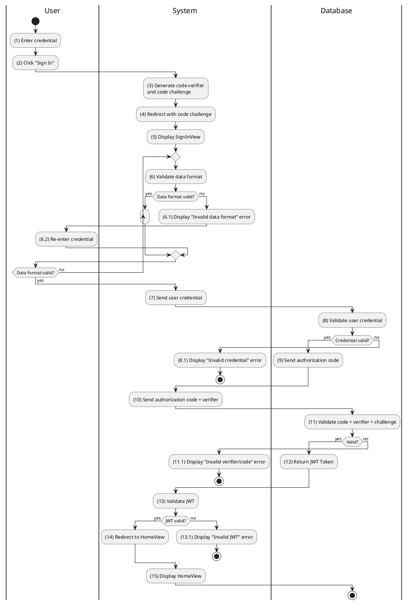

# Activity Sign In

```plantuml
@startuml
|User|
start
:(1) Enter credential;
:(2) Click "Sign In";

|System|
:(3) Generate code verifier\nand code challenge;
:(4) Redirect with code challenge;
:(5) Display SignInView;

repeat
  :(6) Validate data format;
  if (Data format valid?) then (yes)
    --
  else (no)
    :(6.1) Display "Invalid data format" error;
    |User|
    :(6.2) Re-enter credential;
  endif
repeat while (Data format valid?) is (no) not (yes)

|System|
:(7) Send user credential;

|Database|
:(8) Validate user credential;
if (Credential valid?) then (yes)
  :(9) Send authorization code;
else (no)
  |System|
  :(8.1) Display "Invalid credential" error;
  stop
endif

|System|
:(10) Send authorization code + verifier;

|Database|
:(11) Validate code + verifier + challenge;
if (Valid?) then (yes)
  :(12) Return JWT Token;
else (no)
  |System|
  :(11.1) Display "Invalid verifier/code" error;
  stop
endif

|System|
:(13) Validate JWT;
if (JWT valid?) then (yes)
  :(14) Redirect to HomeView;
else (no)
  :(13.1) Display "Invalid JWT" error;
  stop
endif

|System|
:(15) Display HomeView;
|Database|
stop
@enduml
```

<!-- diagram id="activity-sign-in" -->
