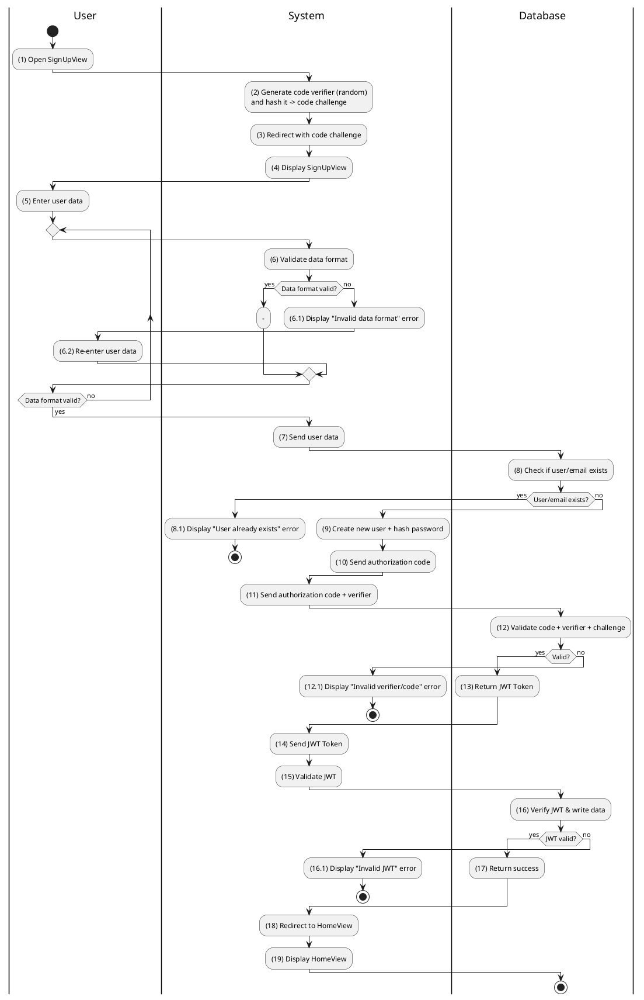

# Activity Sign Up

```plantuml
@startuml
|User|
start
:(1) Open SignUpView;

|System|
:(2) Generate code verifier (random)\nand hash it -> code challenge;
:(3) Redirect with code challenge;
:(4) Display SignUpView;

|User|
:(5) Enter user data;

repeat
  |System|
  :(6) Validate data format;
  if (Data format valid?) then (yes)
    --
  else (no)
    :(6.1) Display "Invalid data format" error;
    |User|
    :(6.2) Re-enter user data;
  endif
repeat while (Data format valid?) is (no) not (yes)

|System|
:(7) Send user data;

|Database|
:(8) Check if user/email exists;
if (User/email exists?) then (yes)
  |System|
  :(8.1) Display "User already exists" error;
  stop
else (no)
  :(9) Create new user + hash password;
  :(10) Send authorization code;
endif

|System|
:(11) Send authorization code + verifier;

|Database|
:(12) Validate code + verifier + challenge;
if (Valid?) then (yes)
  :(13) Return JWT Token;
else (no)
  |System|
  :(12.1) Display "Invalid verifier/code" error;
  stop
endif

|System|
:(14) Send JWT Token;
:(15) Validate JWT;

|Database|
:(16) Verify JWT & write data;
if (JWT valid?) then (yes)
  :(17) Return success;
else (no)
  |System|
  :(16.1) Display "Invalid JWT" error;
  stop
endif

|System|
:(18) Redirect to HomeView;
:(19) Display HomeView;

|Database|
stop
@enduml
```
