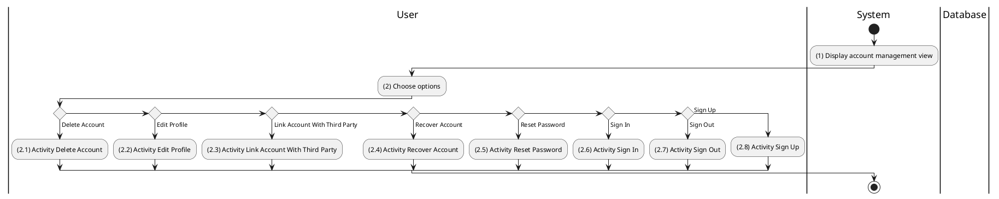

# Activity Manage Account

```plantuml
@startuml
|U|User
|S|System
|D|Database

|S|
start
:(1) Display account management view;

|U|
:(2) Choose options;
if () then (Delete Account)
  :(2.1) Activity Delete Account;
elseif () then (Edit Profile)
  :(2.2) Activity Edit Profile;
elseif () then (Link Account With Third Party)
  :(2.3) Activity Link Account With Third Party;
elseif () then (Recover Account)
  :(2.4) Activity Recover Account;
elseif () then (Reset Password)
  :(2.5) Activity Reset Password;
elseif () then (Sign In)
  :(2.6) Activity Sign In;
elseif () then (Sign Out)
  :(2.7) Activity Sign Out;
else (Sign Up)
  :(2.8) Activity Sign Up;
endif

|S|
stop
@enduml
```

<!-- diagram id="activity-manage-account-manage-account" -->