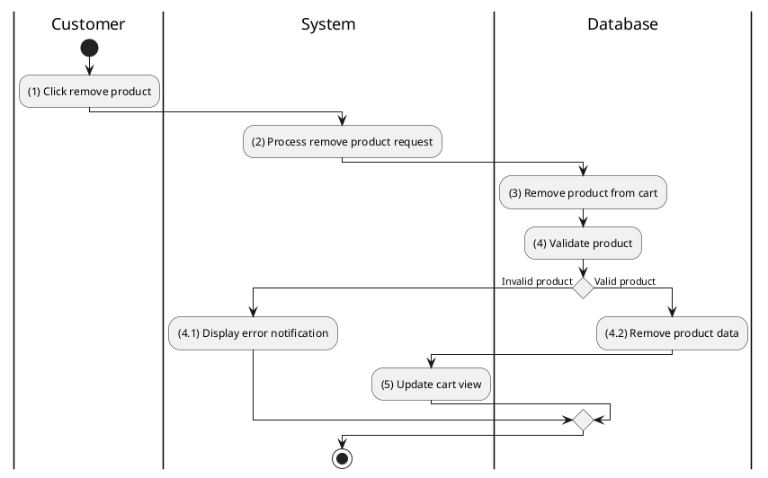

# Activity Remove Product from Cart

```plantuml
@startuml
|C|Customer
|S|System
|D|Database

|C|
start
:(1) Click remove product;
|S|
:(2) Process remove product request;
|D|
:(3) Remove product from cart;
:(4) Validate product;
if () then (Invalid product)
  |S|
  :(4.1) Display error notification;
else (Valid product)
  |D|
  :(4.2) Remove product data;
  |S|
  :(5) Update cart view;
endif
stop

@enduml
```

<!-- diagram id="activity-manage-cart-remove-product-from-cart" -->