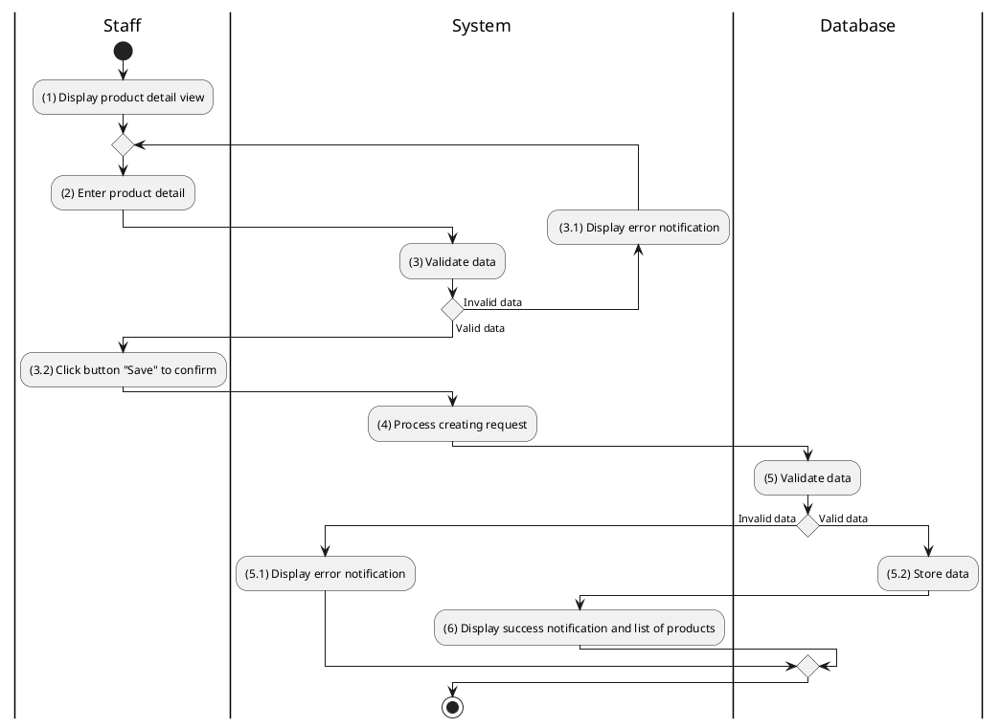

# Activity Add Product

```plantuml
@startuml
|St|Staff
|S|System
|D|Database

|St|
start
:(1) Display product detail view;
repeat
  |St|
  :(2) Enter product detail;
  |S|
  :(3) Validate data;
backward: (3.1) Display error notification;
repeat while () is (Invalid data) not (Valid data)
|St|
:(3.2) Click button "Save" to confirm;
|S|
:(4) Process creating request;
|D|
:(5) Validate data;
if () then (Invalid data)
  |S|
  :(5.1) Display error notification;
else (Valid data)
  |D|
  :(5.2) Store data;
  |S|
  :(6) Display success notification and list of products;
endif
stop

@enduml
```

<!-- diagram id="activity-manage-product-add-product" -->