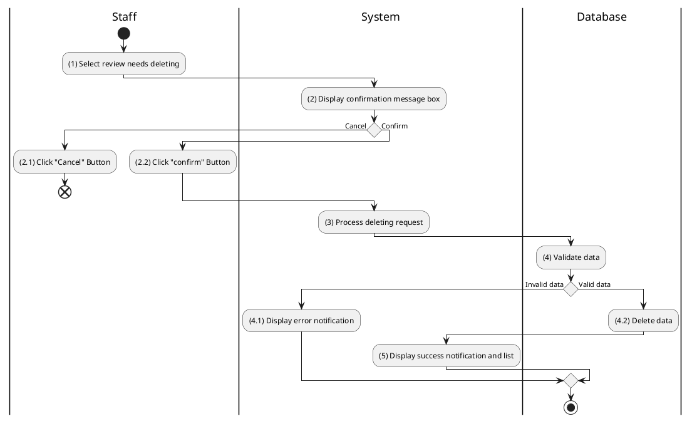

# Activity Delete Review

```plantuml
@startuml
|St|Staff
|S|System
|D|Database

|St|
start
:(1) Select review needs deleting;
|S|
:(2) Display confirmation message box;
if () then (Cancel)
  |St|
  :(2.1) Click "Cancel" Button;
  end
else (Confirm)
  :(2.2) Click "confirm" Button;
endif
|S|
:(3) Process deleting request;
|D|
:(4) Validate data;
if () then (Invalid data)
  |S|
  :(4.1) Display error notification;
else (Valid data)
  |D|
  :(4.2) Delete data;
  |S|
  :(5) Display success notification and list;
endif
|D|
stop

@enduml
```

<!-- diagram id="activity-manage-product-delete-review" -->