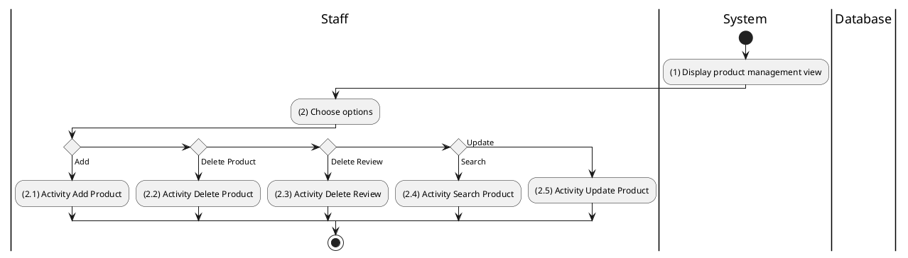

# Activity Manage Product

```plantuml
@startuml
|St|Staff
|S|System
|D|Database

|S|
start
:(1) Display product management view;

|St|
:(2) Choose options;
if () then (Add)
  :(2.1) Activity Add Product;
elseif () then (Delete Product)
  :(2.2) Activity Delete Product;
elseif () then (Delete Review)
  :(2.3) Activity Delete Review;
elseif () then (Search)
  :(2.4) Activity Search Product;
else (Update)
  :(2.5) Activity Update Product;
endif

stop
@enduml
```

<!-- diagram id="activity-manage-product-manage-product" -->