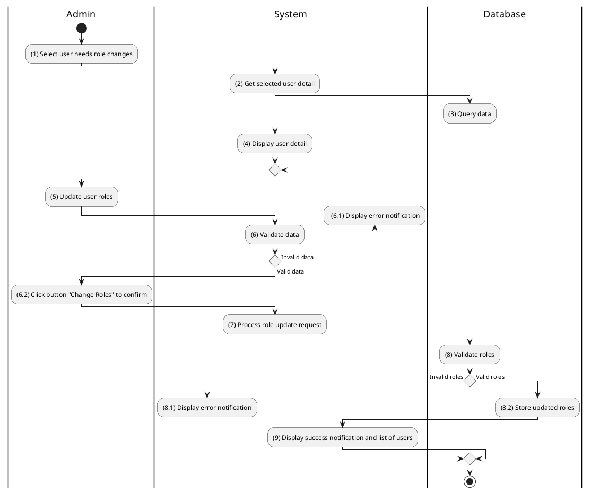

# Activity Change User Roles

```plantuml
@startuml
|A|Admin
|S|System
|D|Database

|A|
start
:(1) Select user needs role changes;
|S|
:(2) Get selected user detail;
|D|
:(3) Query data;
|S|
:(4) Display user detail;
repeat
  |A|
  :(5) Update user roles;
  |S|
  :(6) Validate data;
backward: (6.1) Display error notification;
repeat while () is (Invalid data) not (Valid data)
|A|
:(6.2) Click button "Change Roles" to confirm;
|S|
:(7) Process role update request;
|D|
:(8) Validate roles;
if () then (Invalid roles)
  |S|
  :(8.1) Display error notification;
else (Valid roles)
  |D|
  :(8.2) Store updated roles;
  |S|
  :(9) Display success notification and list of users;
endif
|D|
stop

@enduml
```

<!-- diagram id="activity-manage-user-change-user-roles" -->
