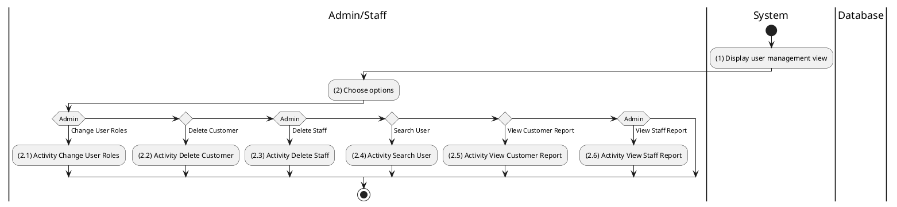

# Activity Manage User

```plantuml
@startuml
|AS|Admin/Staff
|S|System
|D|Database

|S|
start
:(1) Display user management view;

|AS|
:(2) Choose options;
if (Admin) then (Change User Roles)
  :(2.1) Activity Change User Roles;
elseif () then (Delete Customer)
  :(2.2) Activity Delete Customer;
elseif (Admin) then (Delete Staff)
  :(2.3) Activity Delete Staff;
elseif () then (Search User)
  :(2.4) Activity Search User;
elseif () then (View Customer Report)
  :(2.5) Activity View Customer Report;
elseif (Admin) then (View Staff Report)
  :(2.6) Activity View Staff Report;
endif

stop
@enduml
@enduml
```

<!-- diagram id="activity-manage-user-manage-user" -->
