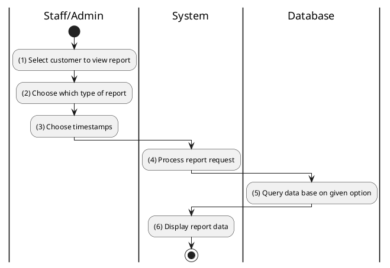

# Activity View Customer Report

```plantuml
@startuml
|SA|Staff/Admin
|S|System
|D|Database

|SA|
start
:(1) Select customer to view report;
:(2) Choose which type of report;
:(3) Choose timestamps;
|S|
:(4) Process report request;
|D|
:(5) Query data base on given option;
|S|
:(6) Display report data;
stop

@enduml
```

<!-- diagram id="activity-manage-user-view-customer-report" -->