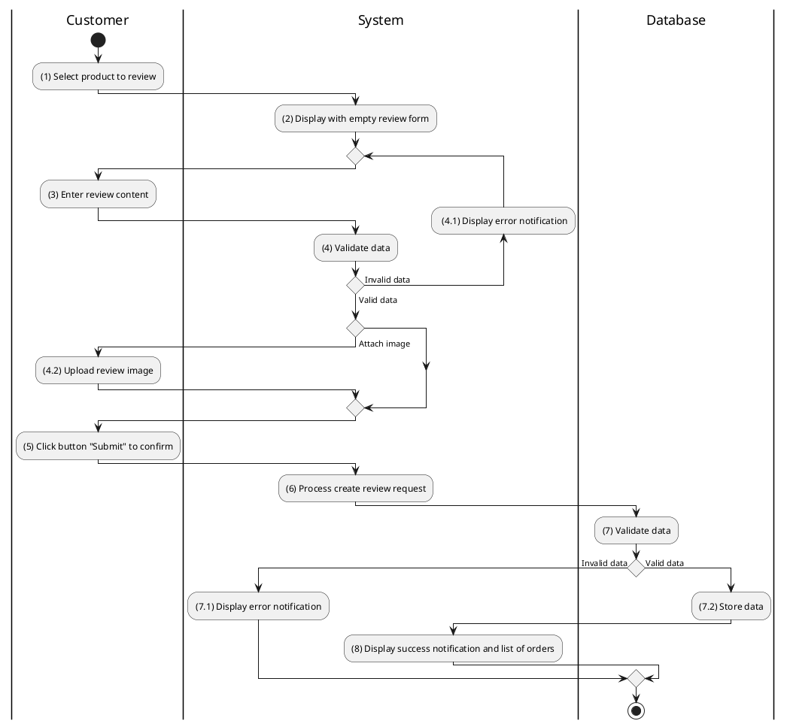

# Activity Review Product

```plantuml
@startuml
|C|Customer
|S|System
|D|Database

|C|
start
:(1) Select product to review;
|S|
:(2) Display with empty review form;
repeat
  |C|
  :(3) Enter review content;
  |S|
  :(4) Validate data;
backward: (4.1) Display error notification;
repeat while () is (Invalid data) not (Valid data)
if () then (Attach image)
  |C|
  :(4.2) Upload review image;
endif
|C|
:(5) Click button "Submit" to confirm;
|S|
:(6) Process create review request;
|D|
:(7) Validate data;
if () then (Invalid data)
  |S|
  :(7.1) Display error notification;
else (Valid data)
  |D|
  :(7.2) Store data;
  |S|
  :(8) Display success notification and list of orders;
endif
|D|
stop

@enduml
```

<!-- diagram id="activity-view-order-review-product" -->