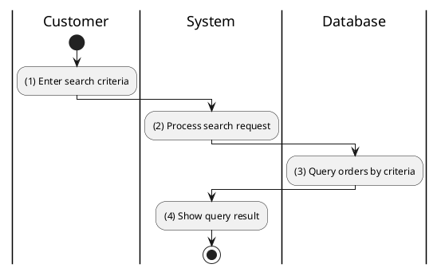

# Activity Search Order

```plantuml
@startuml
|C|Customer
|S|System
|D|Database

|C|
start
:(1) Enter search criteria;
|S|
:(2) Process search request;
|D|
:(3) Query orders by criteria;
|S|
:(4) Show query result;
stop

@enduml
```

<!-- diagram id="activity-view-order-search-order" -->