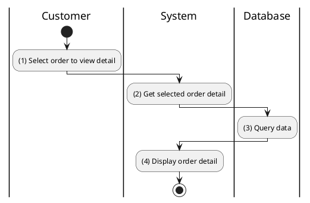

# Activity View Order Detail

```plantuml
@startuml
|C|Customer
|S|System
|D|Database

|C|
start
:(1) Select order to view detail;
|S|
:(2) Get selected order detail;
|D|
:(3) Query data;
|S|
:(4) Display order detail;
stop

@enduml
```

<!-- diagram id="activity-view-order-view-order-detail" -->