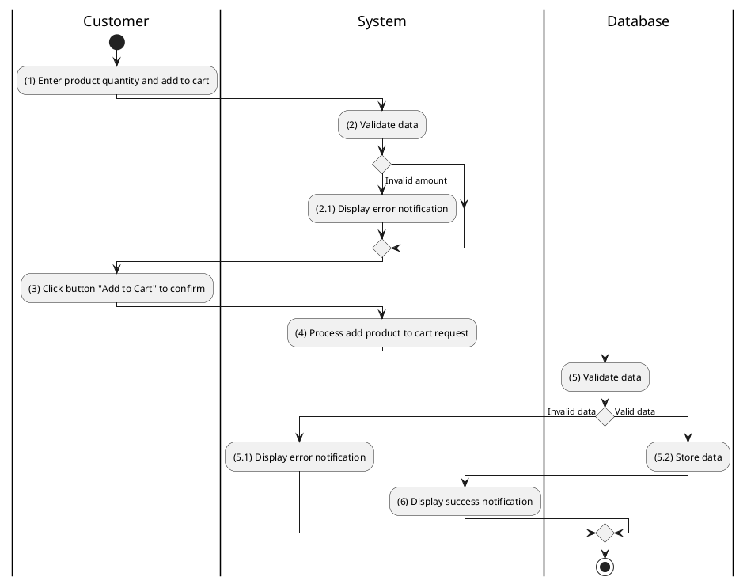

# Activity Add Product to Cart

```plantuml
@startuml
|C|Customer
|S|System
|D|Database

|C|
start
:(1) Enter product quantity and add to cart;
|S|
:(2) Validate data;
if () then (Invalid amount)
  :(2.1) Display error notification;
endif
|C|
:(3) Click button "Add to Cart" to confirm;
|S|
:(4) Process add product to cart request;
|D|
:(5) Validate data;
if () then (Invalid data)
  |S|
  :(5.1) Display error notification;
else (Valid data)
  |D|
  :(5.2) Store data;
  |S|
  :(6) Display success notification;
endif
|D|
stop

@enduml
```

<!-- diagram id="activity-view-product-add-product-to-cart" -->