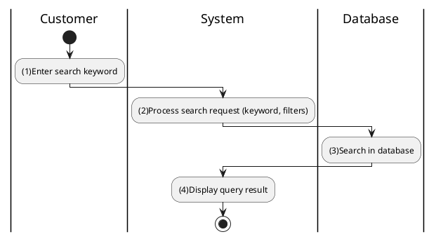

# Search Product

```plantuml
@startuml
|Customer|
start
:(1)Enter search keyword;

|System|
:(2)Process search request (keyword, filters);

|Database|
:(3)Search in database;
|System|
:(4)Display query result;

stop
@enduml
```

<!-- diagram id="activity-search-product-search-product" -->
