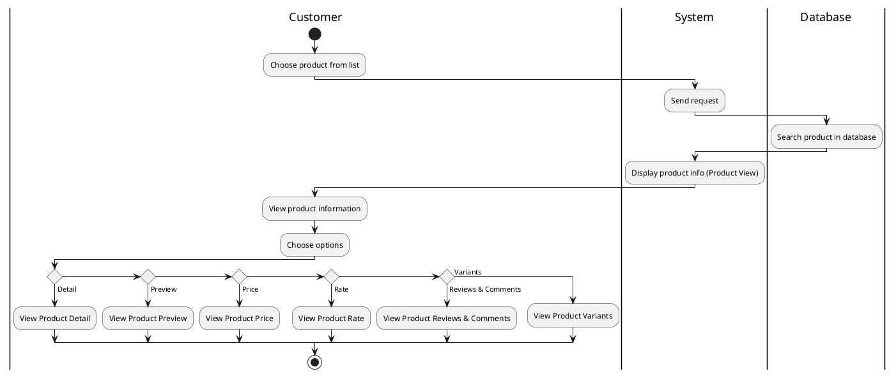

# View Product

```plantuml
@startuml
|Customer|
start
:Choose product from list;

|System|
:Send request;

|Database|
:Search product in database;

|System|
:Display product info (Product View);

|Customer|
:View product information;
:Choose options;
if () then (Detail)
  :View Product Detail;
elseif () then (Preview)
  :View Product Preview;
elseif () then (Price)
  :View Product Price;
elseif () then (Rate)
  :View Product Rate;
elseif () then(Reviews & Comments)
  :View Product Reviews & Comments;
else (Variants)
  :View Product Variants;
endif

|Customer|
stop
@enduml

```
