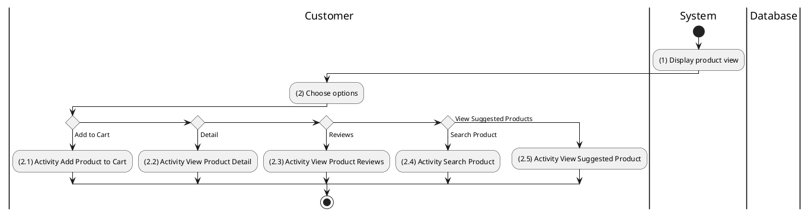

# Activity View Product

```plantuml
@startuml
|C|Customer
|S|System
|D|Database

|S|
start
:(1) Display product view;

|C|
:(2) Choose options;
if () then (Add to Cart)
  :(2.1) Activity Add Product to Cart;
elseif () then (Detail)
  :(2.2) Activity View Product Detail;
elseif () then (Reviews)
  :(2.3) Activity View Product Reviews;
elseif () then (Search Product)
  :(2.4) Activity Search Product;
else (View Suggested Products)
  :(2.5) Activity View Suggested Product;
endif

stop
@enduml
```

<!-- diagram id="activity-view-product-view-product" -->
