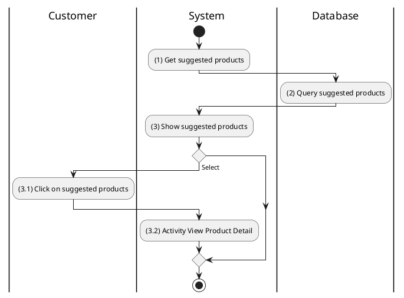

# Activity View Suggested Product

```plantuml
@startuml
|C|Customer
|S|System
|D|Database

|S|
start
:(1) Get suggested products;
|D|
:(2) Query suggested products;
|S|
:(3) Show suggested products;
if () then (Select)
  |C|
  :(3.1) Click on suggested products;
  |S|
  :(3.2) Activity View Product Detail;
endif
stop

@enduml
```

<!-- diagram id="activity-view-product-view-suggested-product" -->