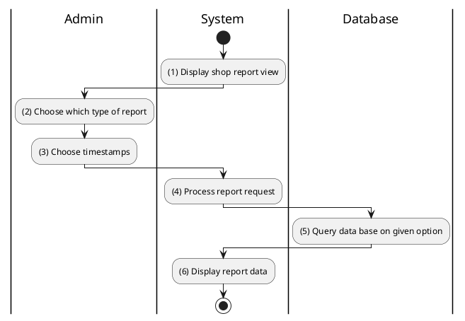

# Activity View Shop Report

```plantuml
@startuml
|A|Admin
|S|System
|D|Database

|S|
start
:(1) Display shop report view;
|A|
:(2) Choose which type of report;
:(3) Choose timestamps;
|S|
:(4) Process report request;
|D|
:(5) Query data base on given option;
|S|
:(6) Display report data;
stop

@enduml
```

<!-- diagram id="activity-view-shop-report-view-shop-report" -->