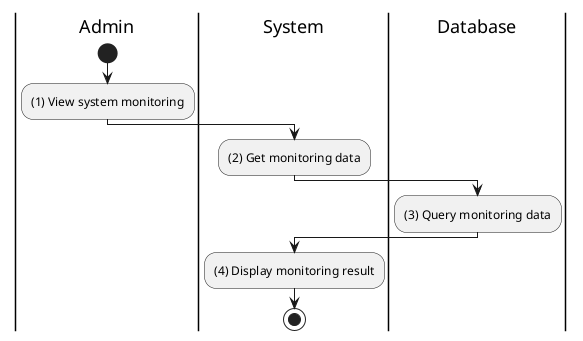

# Activity View System Monitoring

```plantuml
@startuml
|A|Admin
|S|System
|D|Database

|A|
start
:(1) View system monitoring;
|S|
:(2) Get monitoring data;
|D|
:(3) Query monitoring data;
|S|
:(4) Display monitoring result;
stop

@enduml
```

<!-- diagram id="activity-view-system-monitoring-view-system-monitoring" -->