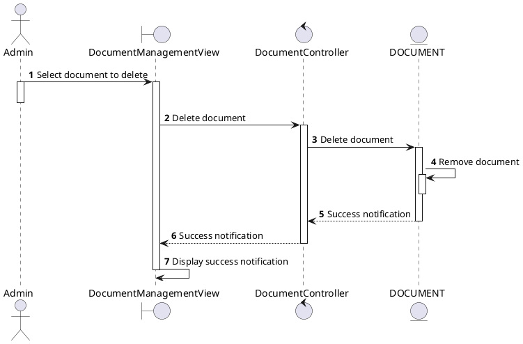

# Sequence Delete Document

```plantuml
@startuml
autonumber

actor Admin as A
boundary DocumentManagementView as DMV
control DocumentController as DC
entity DOCUMENT as D

A -> DMV: Select document to delete
activate A
activate DMV
deactivate A
DMV -> DC: Delete document
activate DC
DC -> D: Delete document
activate D
D -> D: Remove document
activate D
deactivate D
DC <-- D: Success notification
deactivate D
DMV <-- DC: Success notification
deactivate DC
DMV -> DMV: Display success notification
deactivate DMV

@enduml
```

<!-- diagram id="sequence-adjust-document-delete-document" -->
