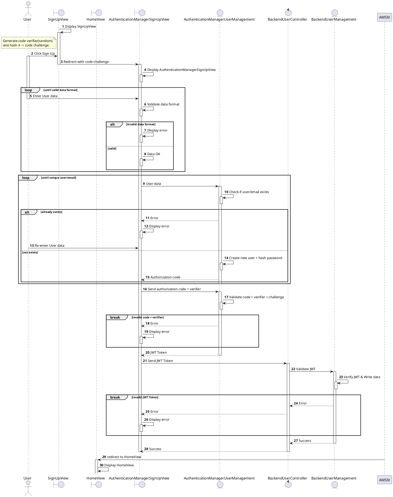

# Sign Up

```plantuml
@startuml
autonumber

actor User as U
boundary SignUpView as SUV
boundary HomeView as HV
boundary AuthenticationManagerSignUpView as AMSUV

entity AuthenticationManagerUserManagement as AMUM
control BackendUserController as BUC
entity BackendUserManagement as BUM

SUV -> SUV: Display SignUpView
activate SUV
note left of SUV: Generate code verifier(random)\nand hash it -> code challenge
U -> SUV: Click Sign Up
activate U
SUV -> AMSUV: Redirect with code challenge
deactivate SUV
activate AMSUV
AMSUV -> AMSUV: Display AuthenticationManagerSignUpView
activate AMSUV
deactivate AMSUV

loop until valid data format
  U -> AMSUV: Enter User data
  deactivate U

  AMSUV -> AMSUV: Validate data format
  activate AMSUV
  deactivate AMSUV

  alt invalid data format
    AMSUV -> AMSUV: Display error
    activate AMSUV
    deactivate AMSUV
  else valid
    AMSUV -> AMSUV: Data OK
    activate AMSUV
    deactivate AMSUV
  end
end

loop until unique user/email
  AMSUV -> AMUM: User data
  activate AMUM
  AMUM -> AMUM: Check if user/email exists
  activate AMUM
  deactivate AMUM

  alt already exists
    AMSUV <-- AMUM: Error
    AMSUV -> AMSUV: Display error
    activate AMSUV
    deactivate AMSUV
    U -> AMSUV: Re-enter User data
    deactivate U
  else not exists
    AMUM -> AMUM: Create new user + hash password
    activate AMUM
    deactivate AMUM
    AMSUV <-- AMUM: Authorization code
  end
  deactivate AMUM
end

AMSUV -> AMUM: Send authorization code + verifier
activate AMUM
AMUM -> AMUM: Validate code + verifier + challenge
activate AMUM
deactivate AMUM

break invalid code + verifier
  AMSUV <-- AMUM: Error
  AMSUV -> AMSUV: Display error
  activate AMSUV
  deactivate AMSUV
end

AMSUV <-- AMUM: JWT Token
deactivate AMUM


AMSUV -> BUC: Send JWT Token
activate BUC

BUC -> BUM: Validate JWT
activate BUM
BUM -> BUM: Verify JWT & Write data
activate BUM
deactivate BUM

break invalid JWT Token
  BUC <-- BUM: Error
  AMSUV <-- BUC: Error
  AMSUV -> AMSUV: Display error
  activate AMSUV
  deactivate AMSUV
end

BUC <-- BUM: Success
deactivate BUM
AMSUV <-- BUC: Success
deactivate BUC
deactivate AMSUV
HV <- AMSIV: redirect to HomeView
deactivate AMSIV
activate HV
deactivate HV
HV -> HV: Display HomeView

@enduml
```

<!-- diagram id="sequence-auth-sign-up" -->
