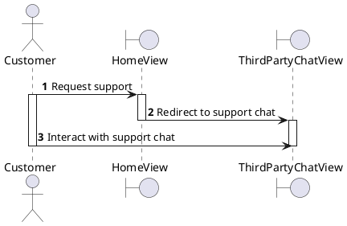

# Sequence Contact Support

```plantuml
@startuml
autonumber

actor Customer as C
boundary HomeView as HV
boundary ThirdPartyChatView as TPCV

C -> HV: Request support
activate C
activate HV
HV -> TPCV: Redirect to support chat
deactivate HV
activate TPCV
C -> TPCV: Interact with support chat
deactivate TPCV
deactivate C

@enduml
```

<!-- diagram id="sequence-contact-support-contact-support" -->
