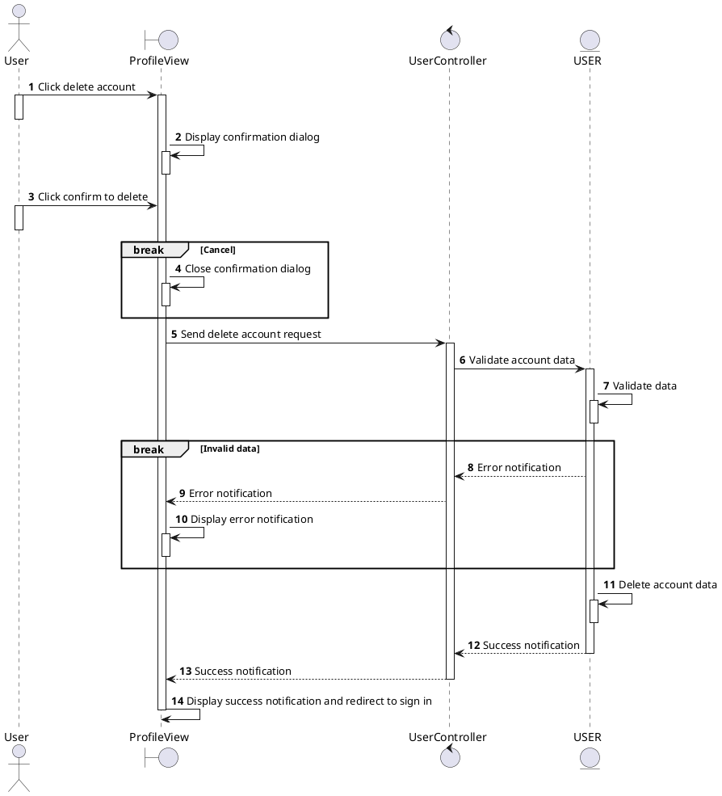

# Sequence Delete Account

```plantuml
@startuml
autonumber

actor User as U
boundary ProfileView as PV
control UserController as UC
entity USER as Us

U -> PV: Click delete account
activate U
activate PV
deactivate U
PV -> PV: Display confirmation dialog
activate PV
deactivate PV
U -> PV: Click confirm to delete
activate U
deactivate U
break Cancel
  PV -> PV: Close confirmation dialog
  activate PV
  deactivate PV
end
PV -> UC: Send delete account request
activate UC
UC -> Us: Validate account data
activate Us
Us -> Us: Validate data
activate Us
deactivate Us
break Invalid data
  UC <-- Us: Error notification
  PV <-- UC: Error notification
  PV -> PV: Display error notification
  activate PV
  deactivate PV
end
Us -> Us: Delete account data
activate Us
deactivate Us
UC <-- Us: Success notification
deactivate Us
PV <-- UC: Success notification
deactivate UC
PV -> PV: Display success notification and redirect to sign in
deactivate PV

@enduml
```

<!-- diagram id="sequence-manage-account-delete-account" -->