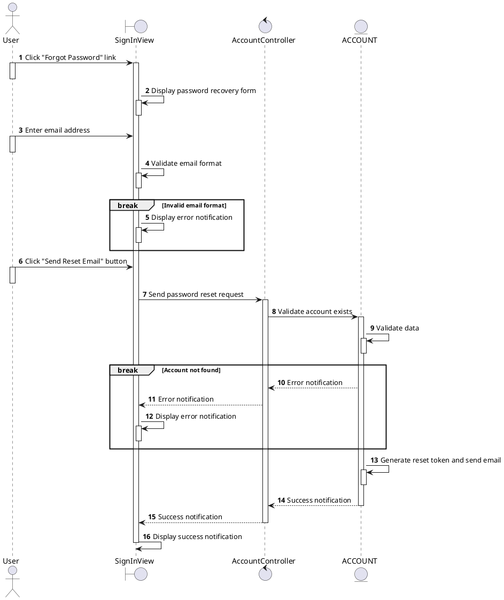

# Sequence Recover Account

```plantuml
@startuml
autonumber

actor User as U
boundary SignInView as SIV
control AccountController as AC
entity ACCOUNT as A

U -> SIV: Click "Forgot Password" link
activate U
activate SIV
deactivate U
SIV -> SIV: Display password recovery form
activate SIV
deactivate SIV
U -> SIV: Enter email address
activate U
deactivate U
SIV -> SIV: Validate email format
activate SIV
deactivate SIV
break Invalid email format
  SIV -> SIV: Display error notification
  activate SIV
  deactivate SIV
end
U -> SIV: Click "Send Reset Email" button
activate U
deactivate U
SIV -> AC: Send password reset request
activate AC
AC -> A: Validate account exists
activate A
A -> A: Validate data
activate A
deactivate A
break Account not found
  AC <-- A: Error notification
  SIV <-- AC: Error notification
  SIV -> SIV: Display error notification
  activate SIV
  deactivate SIV
end
A -> A: Generate reset token and send email
activate A
deactivate A
AC <-- A: Success notification
deactivate A
SIV <-- AC: Success notification
deactivate AC
SIV -> SIV: Display success notification
deactivate SIV

@enduml
```

<!-- diagram id="sequence-manage-account-recover-account" -->