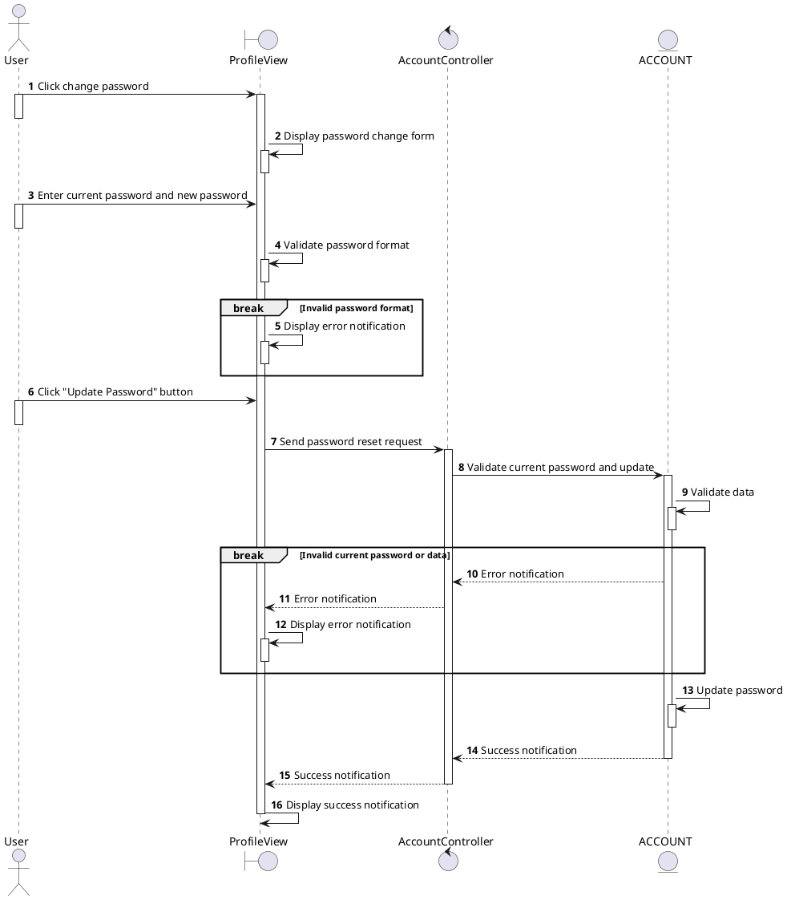

# Sequence Reset Password

```plantuml
@startuml
autonumber

actor User as U
boundary ProfileView as PV
control AccountController as AC
entity ACCOUNT as A

U -> PV: Click change password
activate U
activate PV
deactivate U
PV -> PV: Display password change form
activate PV
deactivate PV
U -> PV: Enter current password and new password
activate U
deactivate U
PV -> PV: Validate password format
activate PV
deactivate PV
break Invalid password format
  PV -> PV: Display error notification
  activate PV
  deactivate PV
end
U -> PV: Click "Update Password" button
activate U
deactivate U
PV -> AC: Send password reset request
activate AC
AC -> A: Validate current password and update
activate A
A -> A: Validate data
activate A
deactivate A
break Invalid current password or data
  AC <-- A: Error notification
  PV <-- AC: Error notification
  PV -> PV: Display error notification
  activate PV
  deactivate PV
end
A -> A: Update password
activate A
deactivate A
AC <-- A: Success notification
deactivate A
PV <-- AC: Success notification
deactivate AC
PV -> PV: Display success notification
deactivate PV

@enduml
```

<!-- diagram id="sequence-manage-account-reset-password" -->