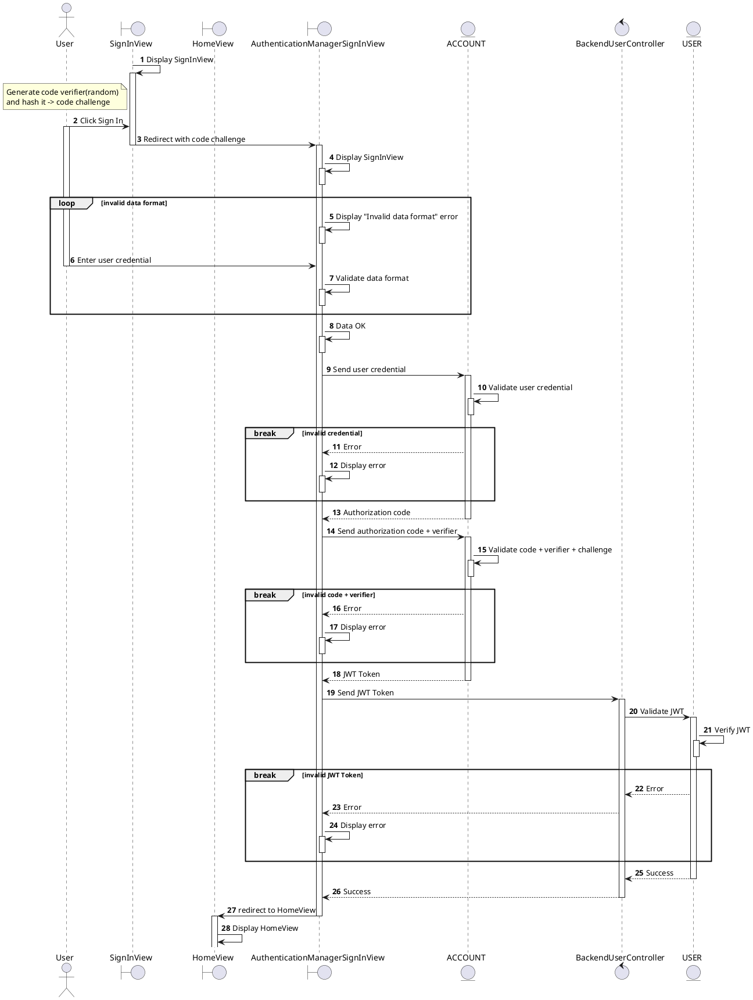

# Sequence Sign In

```plantuml
@startuml
autonumber

actor User as U
boundary SignInView as SIV
boundary HomeView as HV
boundary AuthenticationManagerSignInView as AMSIV
entity ACCOUNT as A
control BackendUserController as BUC
entity USER as US

SIV -> SIV: Display SignInView
activate SIV
note left of SIV: Generate code verifier(random)\nand hash it -> code challenge
U -> SIV: Click Sign In
activate U
SIV -> AMSIV: Redirect with code challenge
deactivate SIV
activate AMSIV

AMSIV -> AMSIV: Display SignInView
activate AMSIV
deactivate AMSIV

loop invalid data format
  AMSIV -> AMSIV: Display "Invalid data format" error
  activate AMSIV
  deactivate AMSIV
  U -> AMSIV: Enter user credential
  deactivate U
  AMSIV -> AMSIV: Validate data format
  activate AMSIV
  deactivate AMSIV
end

AMSIV -> AMSIV: Data OK
activate AMSIV
deactivate AMSIV

AMSIV -> A: Send user credential
activate A

A -> A: Validate user credential
activate A
deactivate A

break invalid credential
  AMSIV <-- A: Error
  AMSIV -> AMSIV: Display error
  activate AMSIV
  deactivate AMSIV
  deactivate U
end

AMSIV <-- A: Authorization code
deactivate A

AMSIV -> A: Send authorization code + verifier
activate A
A -> A: Validate code + verifier + challenge
activate A
deactivate A

break invalid code + verifier
  AMSIV <-- A: Error
  AMSIV -> AMSIV: Display error
  activate AMSIV
  deactivate AMSIV
end

AMSIV <-- A: JWT Token
deactivate A

AMSIV -> BUC: Send JWT Token
activate BUC

BUC -> US: Validate JWT
activate US
US -> US: Verify JWT
activate US
deactivate US

break invalid JWT Token
  BUC <-- US: Error
  AMSIV <-- BUC: Error
  AMSIV -> AMSIV: Display error
  activate AMSIV
  deactivate AMSIV
end

BUC <-- US: Success
deactivate US
AMSIV <-- BUC: Success
deactivate BUC
HV <- AMSIV: redirect to HomeView
deactivate AMSIV
activate HV
deactivate HV
HV -> HV: Display HomeView
@enduml
```

<!-- diagram id="sequence-manage-account-sign-in" -->
