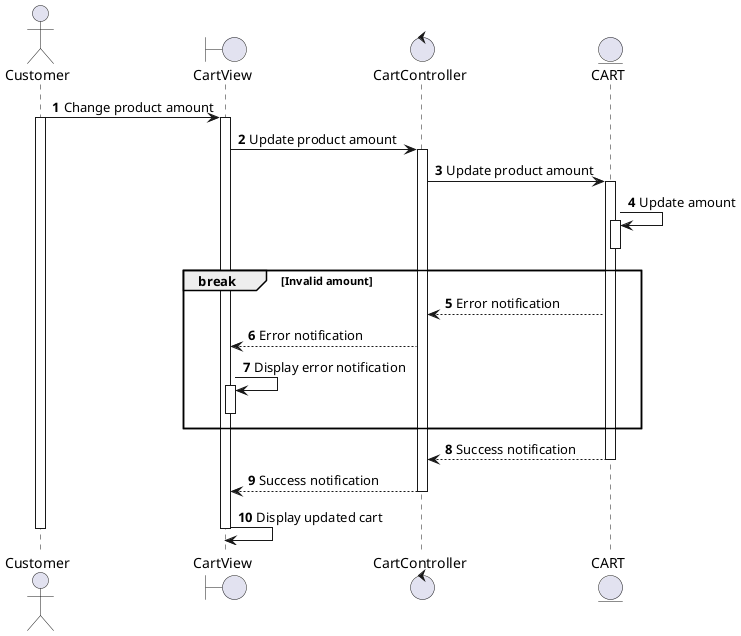

# Sequence Change Product Amount

```plantuml
@startuml
autonumber

actor Customer as C
boundary CartView as CV
control CartController as CC
entity CART as Ca

C -> CV: Change product amount
activate C
activate CV
CV -> CC: Update product amount
activate CC
CC -> Ca: Update product amount
activate Ca
Ca -> Ca: Update amount
activate Ca
deactivate Ca
break Invalid amount
  CC <-- Ca: Error notification
  CV <-- CC: Error notification
  CV -> CV: Display error notification
  activate CV
  deactivate CV
end
CC <-- Ca: Success notification
deactivate Ca
CV <-- CC: Success notification
deactivate CC
CV -> CV: Display updated cart
deactivate CV
deactivate C

@enduml
```

<!-- diagram id="sequence-manage-cart-change-product-amount" -->