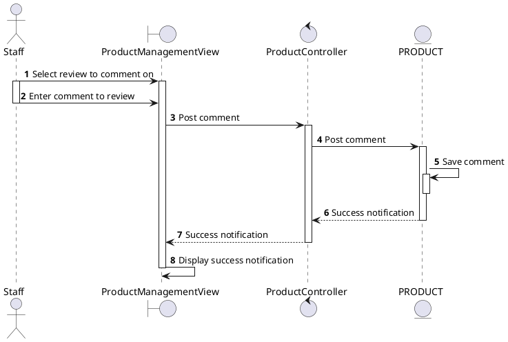

# Sequence Add Comment to Review

```plantuml
@startuml
autonumber

actor Staff as S
boundary ProductManagementView as PMV
control ProductController as PC
entity PRODUCT as P

S -> PMV: Select review to comment on
activate S
activate PMV
S -> PMV: Enter comment to review
deactivate S
PMV -> PC: Post comment
activate PC
PC -> P: Post comment
activate P
P -> P: Save comment
activate P
deactivate P
PC <-- P: Success notification
deactivate P
PMV <-- PC: Success notification
deactivate PC
PMV -> PMV: Display success notification
deactivate PMV

@enduml
```

<!-- diagram id="sequence-manage-product-add-comment-to-review" -->