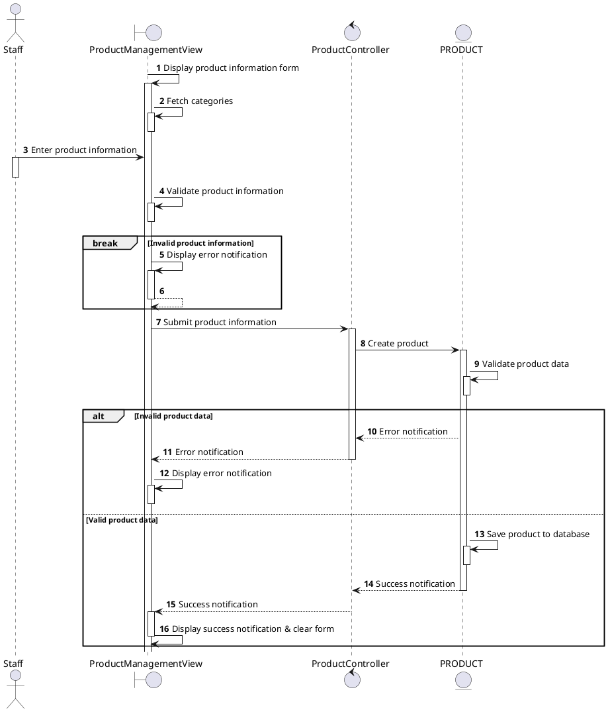

# Sequence Add Product

```plantuml
@startuml
autonumber

actor Staff as S
boundary ProductManagementView as PMV
control ProductController as PC
entity PRODUCT as P

PMV -> PMV: Display product information form
activate PMV 
PMV -> PMV: Fetch categories
activate PMV
deactivate PMV
S -> PMV: Enter product information
activate S
deactivate S
PMV -> PMV: Validate product information
activate PMV
 deactivate PMV
break Invalid product information
  PMV -> PMV: Display error notification
  activate PMV
  return
end
PMV -> PC: Submit product information
activate PC
PC -> P: Create product
activate P
P -> P: Validate product data
activate P
deactivate P
alt Invalid product data
    PC <-- P: Error notification
    PMV <-- PC: Error notification
    deactivate PC
    PMV -> PMV: Display error notification
    activate PMV
    deactivate PMV
else Valid product data
    P -> P: Save product to database
    activate P
    deactivate P
    PC <-- P: Success notification
    deactivate P
    PMV <-- PC: Success notification
    deactivate PC
    activate PMV
    PMV -> PMV: Display success notification & clear form
    deactivate PMV
end

@enduml
```

<!-- diagram id="sequence-manage-product-add-product" -->