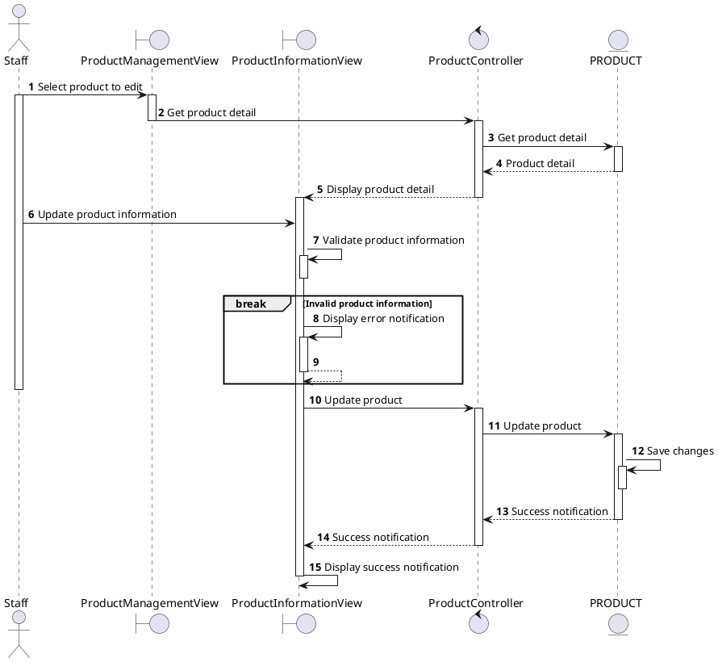

# Sequence Change Product Detail

```plantuml
@startuml
autonumber

actor Staff as S
boundary ProductManagementView as PMV
boundary ProductInformationView as PIV
control ProductController as PC
entity PRODUCT as P

S -> PMV: Select product to edit
activate S
activate PMV
PMV -> PC: Get product detail
deactivate PMV
activate PC
PC -> P: Get product detail
activate P
PC <-- P: Product detail
deactivate P
PIV <-- PC: Display product detail
deactivate PC
activate PIV
S -> PIV: Update product information
PIV -> PIV: Validate product information
activate PIV
deactivate PIV
break Invalid product information
  PIV -> PIV: Display error notification
  activate PIV
  return
end
deactivate S
PIV -> PC: Update product
activate PC
PC -> P: Update product
activate P
P -> P: Save changes
activate P
deactivate P
PC <-- P: Success notification
deactivate P
PIV <-- PC: Success notification
deactivate PC
PIV -> PIV: Display success notification
deactivate PIV

@enduml
```

<!-- diagram id="sequence-manage-product-change-product-detail" -->