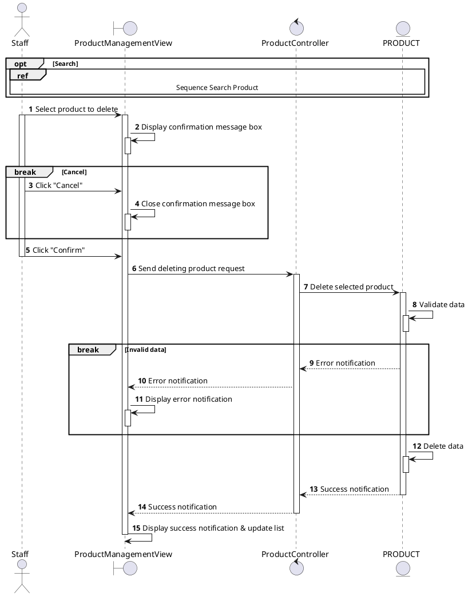

# Sequence Delete Product

```plantuml
@startuml
autonumber

actor Staff as S
boundary ProductManagementView as PMV
control ProductController as PC
entity PRODUCT as P

opt Search
  ref over S, P: Sequence Search Product
end
S -> PMV: Select product to delete
activate S
activate PMV
PMV -> PMV: Display confirmation message box
activate PMV
deactivate PMV
break Cancel
  S -> PMV: Click "Cancel"
  PMV -> PMV: Close confirmation message box
  activate PMV
  deactivate PMV
end
S -> PMV: Click "Confirm"
deactivate S
PMV -> PC: Send deleting product request
activate PC
PC -> P: Delete selected product
activate P
P -> P: Validate data
activate P
deactivate P
break Invalid data
  PC <-- P: Error notification
  PMV <-- PC: Error notification
  PMV -> PMV: Display error notification
  activate PMV
  deactivate PMV
end
P -> P: Delete data
activate P
deactivate P
PC <-- P: Success notification
deactivate P
PMV <-- PC: Success notification
deactivate PC
PMV -> PMV: Display success notification & update list
deactivate PMV
deactivate S

@enduml
```

<!-- diagram id="sequence-manage-product-delete-product" -->
