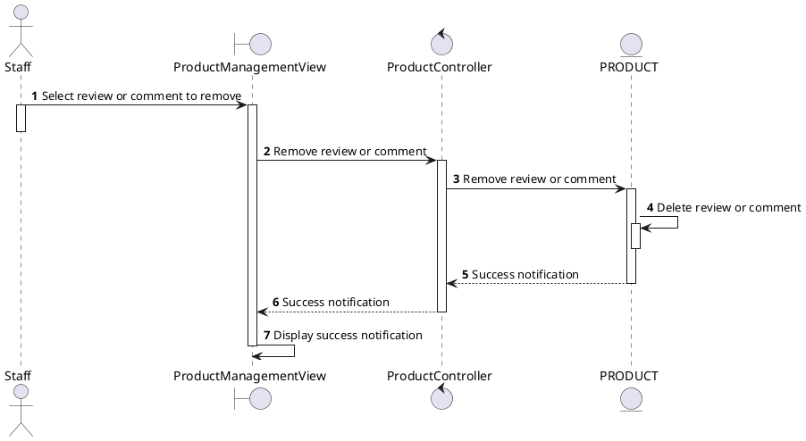

# Sequence Remove Review or Comment

```plantuml
@startuml
autonumber

actor Staff as S
boundary ProductManagementView as PMV
control ProductController as PC
entity PRODUCT as P

S -> PMV: Select review or comment to remove
activate S
activate PMV
deactivate S
PMV -> PC: Remove review or comment
activate PC
PC -> P: Remove review or comment
activate P
P -> P: Delete review or comment
activate P
deactivate P
PC <-- P: Success notification
deactivate P
PMV <-- PC: Success notification
deactivate PC
PMV -> PMV: Display success notification
deactivate PMV

@enduml
```

<!-- diagram id="sequence-manage-product-remove-review-or-comment" -->