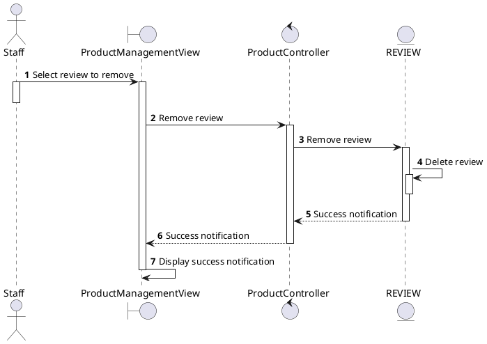

# Sequence Remove Review

```plantuml
@startuml
autonumber

actor Staff as S
boundary ProductManagementView as PMV
control ProductController as PC
entity REVIEW as R

S -> PMV: Select review to remove
activate S
activate PMV
deactivate S
PMV -> PC: Remove review
activate PC
PC -> R: Remove review
activate R
R -> R: Delete review
activate R
deactivate R
PC <-- R: Success notification
deactivate R
PMV <-- PC: Success notification
deactivate PC
PMV -> PMV: Display success notification
deactivate PMV

@enduml
```

<!-- diagram id="sequence-manage-product-remove-review" -->
