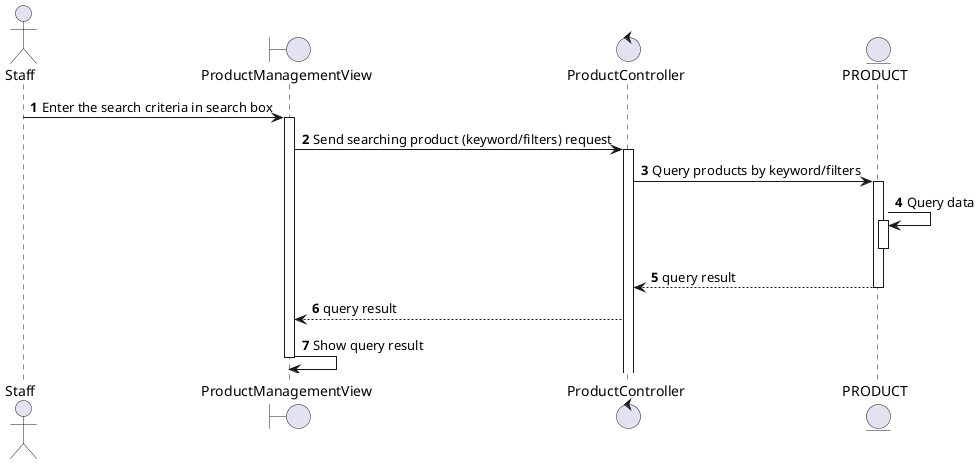

# Search product

```plantuml
@startuml
autonumber

actor Staff as S
boundary ProductManagementView as PMV
control ProductController as PC
entity PRODUCT as P

S -> PMV: Enter the search criteria in search box
activate PMV
PMV -> PC: Send searching product (keyword/filters) request
activate PC
PC -> P: Query products by keyword/filters
activate P
P -> P: Query data
activate P
deactivate P
PC <-- P: query result
deactivate P
PMV <-- PC: query result
PMV -> PMV: Show query result
deactivate PMV

@enduml
```

<!-- diagram id="sequence-manage-product-search-product" -->