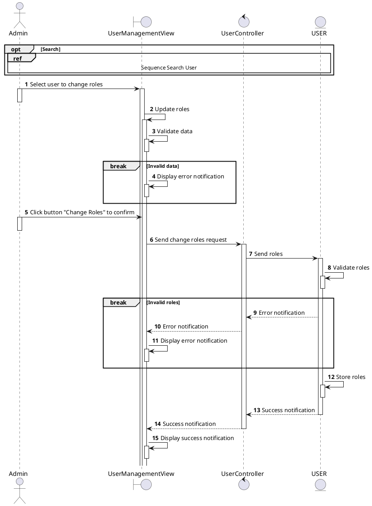

# Sequence Change User Roles

```plantuml
@startuml
autonumber

actor Admin as A
boundary UserManagementView as UMV
control UserController as UC
entity USER as U

opt Search
  ref over A, U: Sequence Search User
end
A -> UMV: Select user to change roles
activate A
activate UMV
deactivate A
UMV -> UMV: Update roles
activate UMV
UMV -> UMV: Validate data
activate UMV
deactivate UMV
break Invalid data
  UMV -> UMV: Display error notification
  activate UMV
  deactivate UMV
end
A -> UMV: Click button "Change Roles" to confirm
activate A
deactivate A
UMV -> UC: Send change roles request
activate UC
UC -> U: Send roles
activate U
U -> U: Validate roles
activate U
deactivate U
break Invalid roles
  UC <-- U: Error notification
  UMV <-- UC: Error notification
  UMV -> UMV: Display error notification
  activate UMV
  deactivate UMV
end
U -> U: Store roles
activate U
deactivate U
UC <-- U: Success notification
deactivate U
UMV <-- UC: Success notification
deactivate UC
UMV -> UMV: Display success notification
activate UMV
deactivate UMV

@enduml
```

<!-- diagram id="sequence-manage-user-change-user-roles" -->
