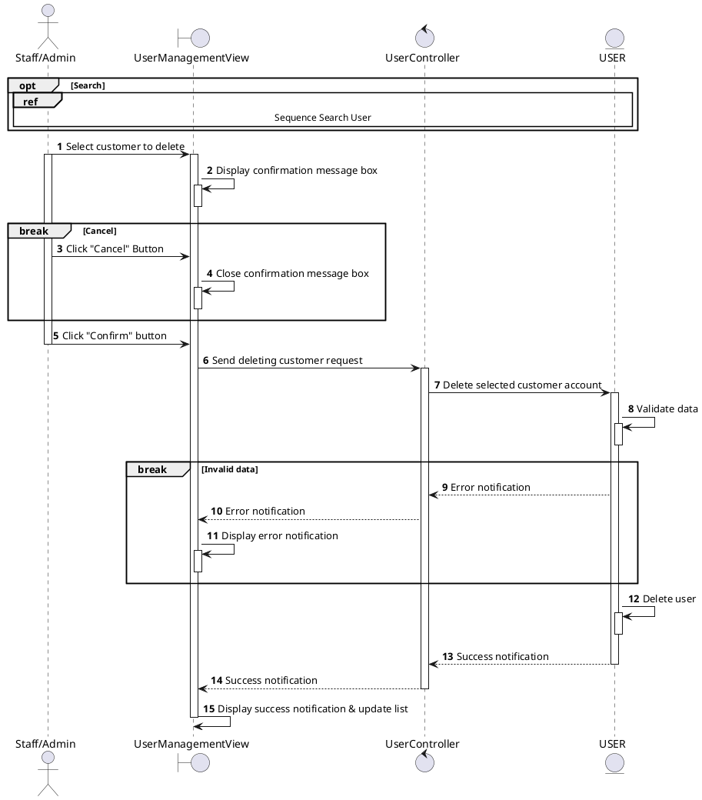

# Sequence Delete Customer

```plantuml
@startuml
autonumber

actor "Staff/Admin" as SA
boundary UserManagementView as UMV
control UserController as UC
entity USER as U

opt Search
  ref over SA, U: Sequence Search User
end
SA -> UMV: Select customer to delete
activate SA
activate UMV
UMV -> UMV: Display confirmation message box
activate UMV
deactivate UMV
break Cancel
  SA -> UMV: Click "Cancel" Button
  UMV -> UMV: Close confirmation message box
  activate UMV
  deactivate UMV
end
SA -> UMV: Click "Confirm" button
deactivate SA
UMV -> UC: Send deleting customer request
activate UC
UC -> U: Delete selected customer account
activate U
U -> U: Validate data
activate U
deactivate U
break Invalid data
  UC <-- U: Error notification
  UMV <-- UC: Error notification
  UMV -> UMV: Display error notification
  activate UMV
  deactivate UMV
end
U -> U: Delete user
activate U
deactivate U
UC <-- U: Success notification
deactivate U
UMV <-- UC: Success notification
deactivate UC
UMV -> UMV: Display success notification & update list
deactivate UMV
deactivate SA

@enduml
```

<!-- diagram id="sequence-manage-user-delete-customer" -->
