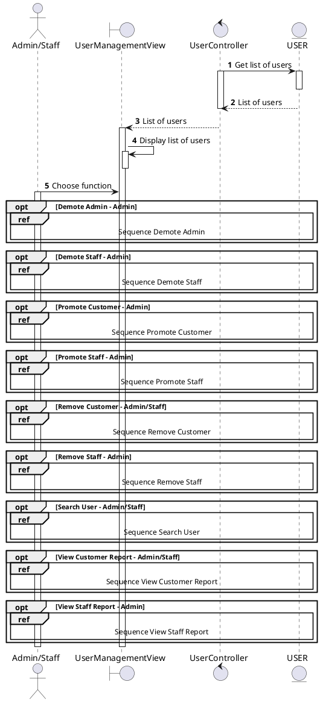

# Sequence Manage User

```plantuml
@startuml
autonumber

actor "Admin/Staff" as AS
boundary UserManagementView as UMV
control UserController as UC
entity USER as U

UC -> U: Get list of users
activate UC
activate U
deactivate U
UC <-- U: List of users
deactivate UC
UMV <-- UC: List of users
activate UMV
UMV -> UMV: Display list of users
activate UMV
deactivate UMV
AS -> UMV: Choose function
activate AS

opt Demote Admin - Admin
  ref over AS, U: Sequence Demote Admin
end

opt Demote Staff - Admin
  ref over AS, U: Sequence Demote Staff
end

opt Promote Customer - Admin
  ref over AS, U: Sequence Promote Customer
end

opt Promote Staff - Admin
  ref over AS, U: Sequence Promote Staff
end

opt Remove Customer - Admin/Staff
  ref over AS, U: Sequence Remove Customer
end

opt Remove Staff - Admin
  ref over AS, U: Sequence Remove Staff
end

opt Search User - Admin/Staff
  ref over AS, U: Sequence Search User
end

opt View Customer Report - Admin/Staff
  ref over AS, U: Sequence View Customer Report
end

opt View Staff Report - Admin
  ref over AS, U: Sequence View Staff Report
end

deactivate UMV
deactivate AS

@enduml
```

<!-- diagram id="sequence-manage-user-manage-user" -->
