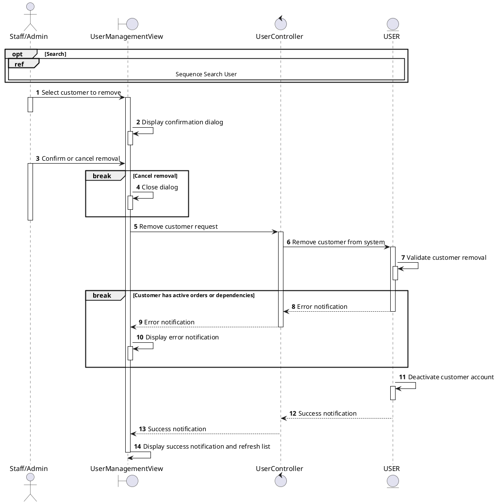

# Sequence Remove Customer

```plantuml
@startuml
autonumber

actor "Staff/Admin" as SA
boundary UserManagementView as UMV
control UserController as UC
entity USER as U

opt Search
  ref over SA, U: Sequence Search User
end
SA -> UMV: Select customer to remove
activate SA
activate UMV
deactivate SA
UMV -> UMV: Display confirmation dialog
activate UMV
deactivate UMV
SA -> UMV: Confirm or cancel removal
activate SA
break Cancel removal
  UMV -> UMV: Close dialog
  activate UMV
  deactivate UMV
end
deactivate SA
UMV -> UC: Remove customer request
activate UC
UC -> U: Remove customer from system
activate U
U -> U: Validate customer removal
activate U
deactivate U
break Customer has active orders or dependencies
  UC <-- U: Error notification
  deactivate U
  UMV <-- UC: Error notification
  deactivate UC
  UMV -> UMV: Display error notification
  activate UMV
  deactivate UMV
end
U -> U: Deactivate customer account
activate U
deactivate U
UC <-- U: Success notification
deactivate U
UMV <-- UC: Success notification
deactivate UC
UMV -> UMV: Display success notification and refresh list
deactivate UMV

@enduml
```

<!-- diagram id="sequence-manage-user-remove-customer" -->
