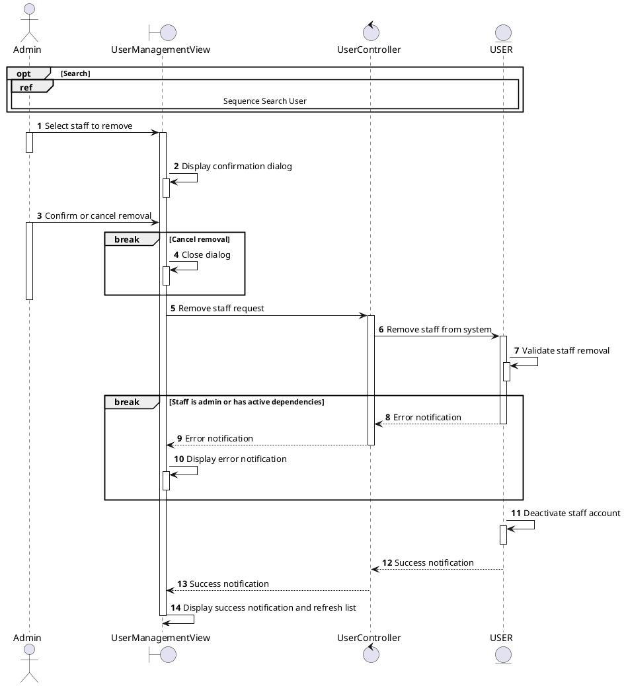

# Sequence Remove Staff

```plantuml
@startuml
autonumber

actor Admin as A
boundary UserManagementView as UMV
control UserController as UC
entity USER as U

opt Search
  ref over A, U: Sequence Search User
end
A -> UMV: Select staff to remove
activate A
activate UMV
deactivate A
UMV -> UMV: Display confirmation dialog
activate UMV
deactivate UMV
A -> UMV: Confirm or cancel removal
activate A
break Cancel removal
  UMV -> UMV: Close dialog
  activate UMV
  deactivate UMV
end
deactivate A
UMV -> UC: Remove staff request
activate UC
UC -> U: Remove staff from system
activate U
U -> U: Validate staff removal
activate U
deactivate U
break Staff is admin or has active dependencies
  UC <-- U: Error notification
  deactivate U
  UMV <-- UC: Error notification
  deactivate UC
  UMV -> UMV: Display error notification
  activate UMV
  deactivate UMV
end
U -> U: Deactivate staff account
activate U
deactivate U
UC <-- U: Success notification
deactivate U
UMV <-- UC: Success notification
deactivate UC
UMV -> UMV: Display success notification and refresh list
deactivate UMV

@enduml
```

<!-- diagram id="sequence-manage-user-remove-staff" -->
