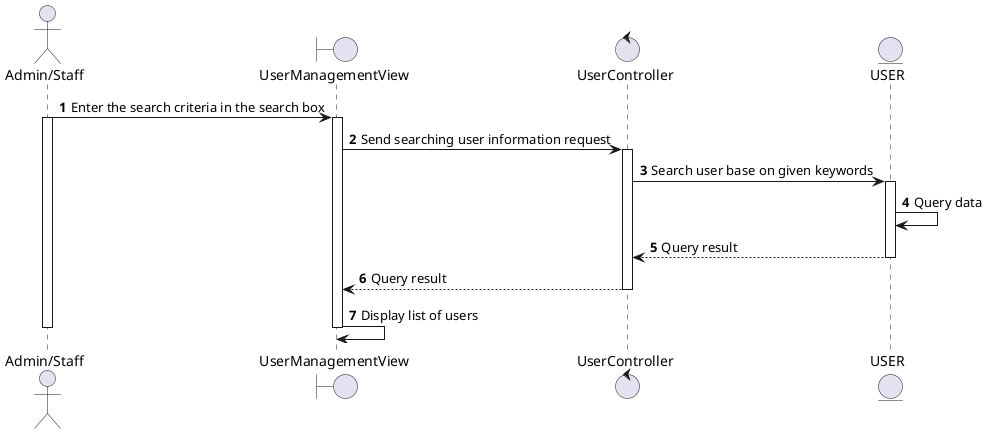

# Sequence Search User

```plantuml
@startuml
autonumber

actor "Admin/Staff" as AS
boundary UserManagementView as UMV
control UserController as UC
entity USER as U

AS -> UMV: Enter the search criteria in the search box
activate AS
activate UMV
UMV -> UC: Send searching user information request
activate UC
UC -> U: Search user base on given keywords
activate U
U -> U: Query data
UC <-- U: Query result
deactivate U
UMV <-- UC: Query result
deactivate UC
UMV -> UMV: Display list of users
deactivate UMV
deactivate AS

@enduml
```

<!-- diagram id="sequence-manage-user-search-user" -->
