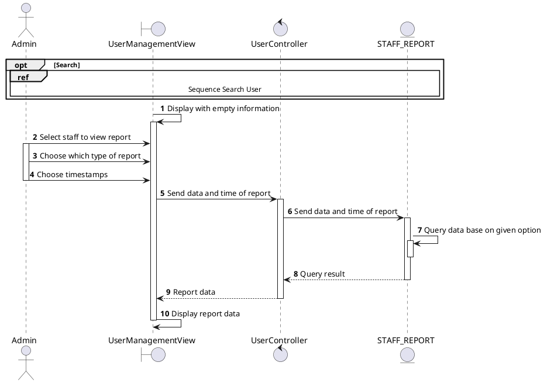

# Sequence View Staff Report

```plantuml
@startuml
autonumber

actor Admin as A
boundary UserManagementView as UMV
control UserController as UC
entity STAFF_REPORT as SR

opt Search
  ref over A, SR: Sequence Search User
end
UMV -> UMV: Display with empty information
activate UMV
A -> UMV: Select staff to view report
activate A
A -> UMV: Choose which type of report
A -> UMV: Choose timestamps
deactivate A
UMV -> UC: Send data and time of report
activate UC
UC -> SR: Send data and time of report
activate SR
SR -> SR: Query data base on given option
activate SR
deactivate SR
UC <-- SR: Query result
deactivate SR
UMV <-- UC: Report data
deactivate UC
UMV -> UMV: Display report data
deactivate UMV

@enduml
```

<!-- diagram id="sequence-manage-user-view-staff-report" -->
