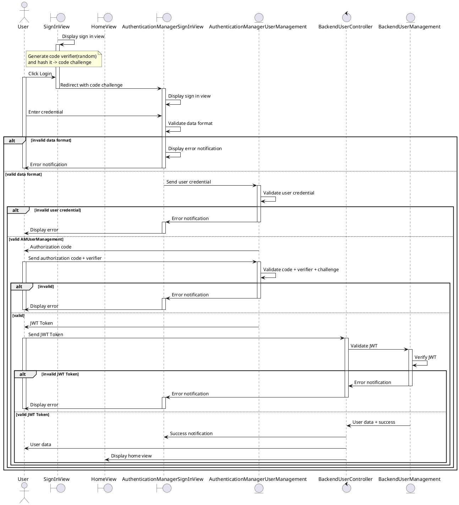

# Login with Credential

```plantuml
@startuml
actor User
boundary SignInView
boundary HomeView
boundary AuthenticationManagerSignInView as AMSignInView
entity AuthenticationManagerUserManagement as AMUserManagement
control BackendUserController
entity BackendUserManagement

SignInView -> SignInView: Display sign in view
activate SignInView
note right of User: Generate code verifier(random)\nand hash it -> code challenge
User -> SignInView: Click Login
activate User
SignInView -> AMSignInView: Redirect with code challenge
deactivate SignInView
activate AMSignInView

AMSignInView -> AMSignInView: Display sign in view
User -> AMSignInView: Enter credential
AMSignInView -> AMSignInView: Validate data format

alt invalid data format
  AMSignInView -> AMSignInView: Display error notification
  AMSignInView -> User: Error notification
  deactivate AMSignInView
  deactivate User
else valid data format
  AMSignInView -> AMUserManagement: Send user credential
  deactivate AMSignInView
  activate AMUserManagement

  AMUserManagement -> AMUserManagement: Validate user credential

  alt invalid user credential
    AMUserManagement -> AMSignInView: Error notification
    deactivate AMUserManagement
    activate AMSignInView
    AMSignInView -> User: Display error
    deactivate AMSignInView
    deactivate User
  else valid AMUserManagement
    AMUserManagement -> User: Authorization code
    deactivate AMUserManagement
    deactivate User

    User -> AMUserManagement: Send authorization code + verifier
    activate User
    activate AMUserManagement
    AMUserManagement -> AMUserManagement: Validate code + verifier + challenge

    alt invalid
      AMUserManagement -> AMSignInView: Error notification
      deactivate AMUserManagement
      activate AMSignInView
      AMSignInView -> User: Display error
      deactivate AMSignInView
      deactivate User
    else valid
      AMUserManagement -> User: JWT Token
      deactivate AMUserManagement
      deactivate User

      User -> BackendUserController: Send JWT Token
      activate User
      activate BackendUserController

      BackendUserController -> BackendUserManagement: Validate JWT
      activate BackendUserManagement
      BackendUserManagement -> BackendUserManagement: Verify JWT

      alt invalid JWT Token
        BackendUserManagement -> BackendUserController: Error notification
        deactivate BackendUserManagement
        BackendUserController -> AMSignInView: Error notification
        deactivate BackendUserController
        activate AMSignInView
        AMSignInView -> User: Display error
        deactivate AMSignInView
        deactivate User
      else valid JWT Token
        BackendUserManagement -> BackendUserController: User data + success
        deactivate BackendUserManagement
        BackendUserController -> AMSignInView: Success notification
        BackendUserController -> User: User data
        BackendUserController -> HomeView: Display home view
        deactivate BackendUserController
        deactivate User
        deactivate HomeView
      end
    end
  end
end
@enduml
```
