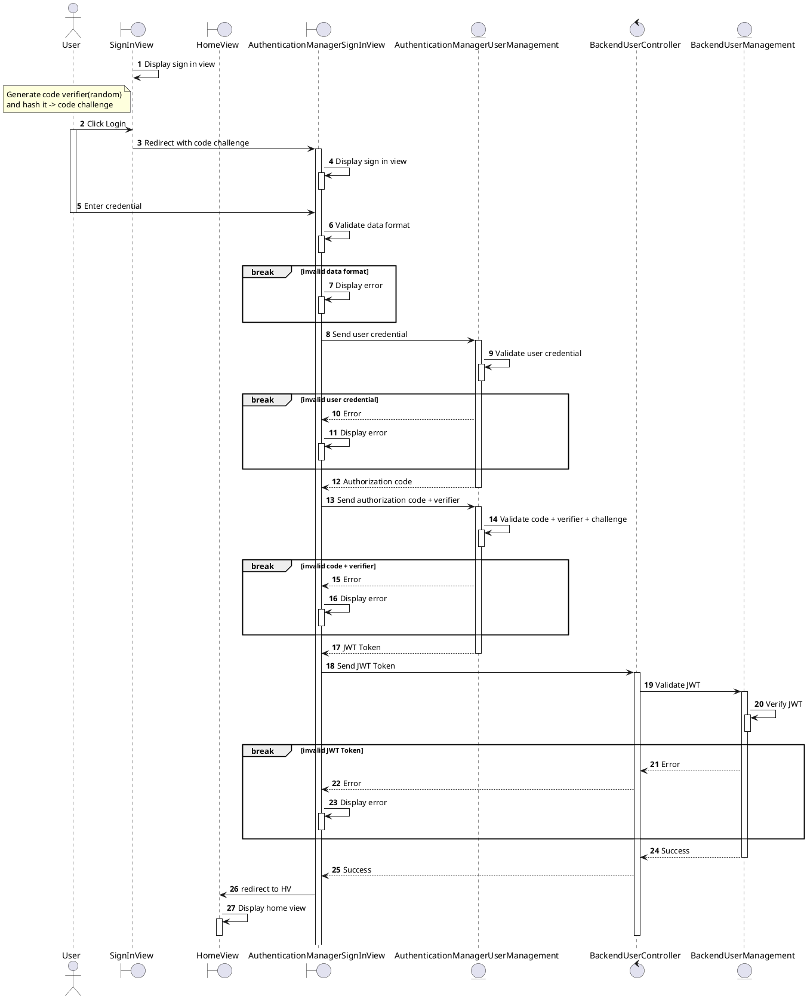

# Sign In with Credential



<!-- diagram id="sequence-credential-sign-in" -->

# Sign Up

```plantuml
@startuml
autonumber

actor User as U
boundary SignUpView as SUV
boundary HomeView as HV
boundary AuthenticationManagerSignUpView as AMSUV

entity AuthenticationManagerUserManagement as AMUM
control BackendUserController as BUC entity BackendUserManagement as BUM

SUV -> SUV: Display sign up view
activate SUV
note left of SUV: Generate code verifier(random)\nand hash it -> code challenge
U -> SUV: Click Sign Up
activate U
SUV -> AMSUV: Redirect with code challenge
activate AMSUV
AMSUV -> AMSUV: Display AMSUV
activate AMSUV
deactivate AMSUV

deactivate SUV

U -> AMSUV: Enter User data
deactivate U

AMSUV -> AMSUV: Validate data format
activate AMSUV
deactivate AMSUV

break invalid data format
  AMSUV -> AMSUV: Display error
  activate AMSUV
  deactivate AMSUV
end

AMSUV -> AMUM: User data
activate AMUM
AMUM -> AMUM: Check if user/email exists
activate AMUM
deactivate AMUM

break already exists
  AMSUV <-- AMUM: Error
  AMSUV -> AMSUV: Display error
  activate AMSUV
  deactivate AMSUV
end

AMUM -> AMUM: Create new user + hash password
activate AMUM
deactivate AMUM

AMSUV <-- AMUM: Authorization code
deactivate AMUM

AMSUV -> AMUM: Send authorization code + verifier
activate AMUM
AMUM -> AMUM: Validate code + verifier + challenge
activate AMUM
deactivate AMUM

break invalid code + verifier
  AMSUV <-- AMUM: Error
  AMSUV -> AMSUV: Display error
  activate AMSUV
  deactivate AMSUV
end

AMSUV <-- AMUM: JWT Token
deactivate AMUM


AMSUV -> BUC: Send JWT Token
activate BUC

BUC -> BUM: Validate JWT
activate BUM
BUM -> BUM: Verify JWT & Write data
activate BUM
deactivate BUM

break invalid JWT Token
  BUC <-- BUM: Error
  AMSUV <-- BUC: Error
  AMSUV -> AMSUV: Display error
  activate AMSUV
  deactivate AMSUV
end

BUC <-- BUM: Success
deactivate BUM
AMSUV <-- BUC: Success
HV<-AMSUV: redirect to HV
deactivate AMSUV
HV -> HV: Display home view
deactivate BUC
deactivate HV
@enduml
```

<!-- diagram id="sequence-credential-sign-up" -->
