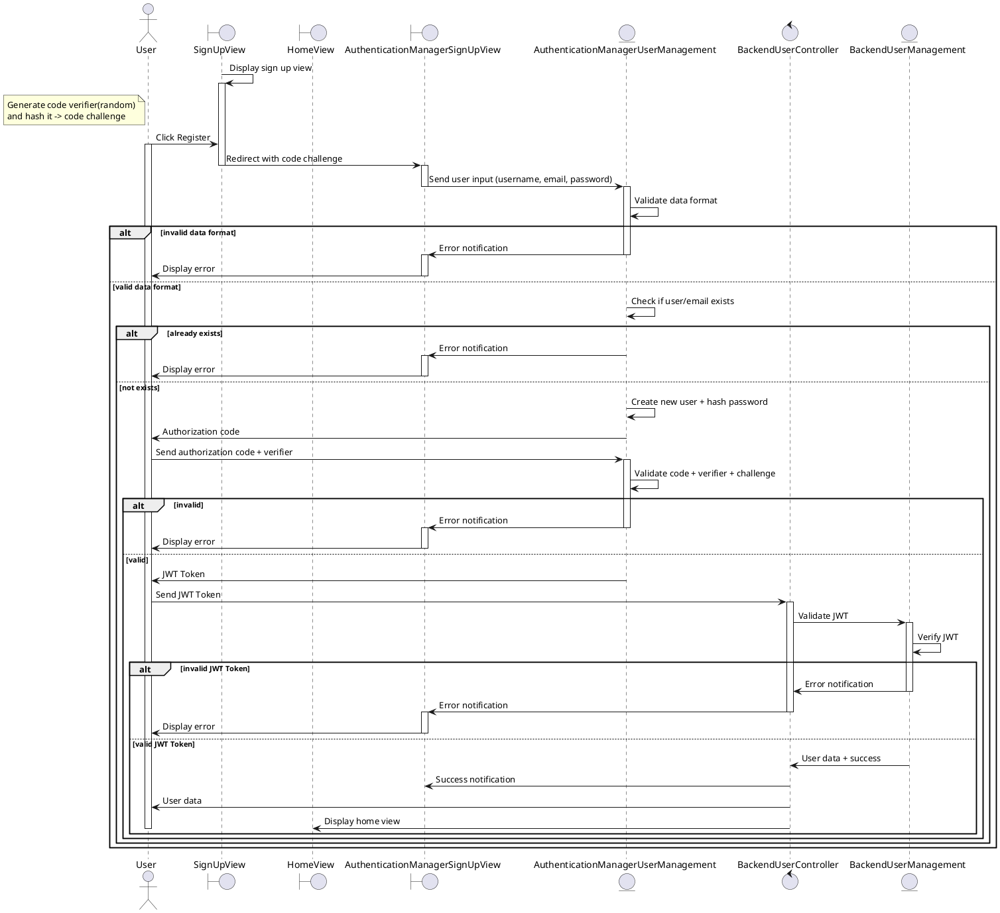

# Login with Credential

```plantuml
@startuml
autonumber

actor User
boundary SignInView
boundary HomeView
boundary AuthenticationManagerSignInView as AMSignInView
entity AuthenticationManagerUserManagement as AMUserManagement
control BackendUserController
entity BackendUserManagement

SignInView -> SignInView: Display sign in view
activate SignInView
note left of User: Generate code verifier(random)\nand hash it -> code challenge
User -> SignInView: Click Login
activate User
SignInView -> AMSignInView: Redirect with code challenge
deactivate SignInView
activate AMSignInView

activate AMSignInView
AMSignInView -> AMSignInView: Display sign in view
deactivate AMSignInView
AMSignInView <-- User: Enter credential
activate AMSignInView
AMSignInView -> AMSignInView: Validate data format
deactivate AMSignInView

break invalid data format
  activate AMSignInView
  AMSignInView -> AMSignInView: Display error notification
  deactivate AMSignInView
  User <-- AMSignInView: Error notification
end

AMSignInView -> AMUserManagement: Send user credential
deactivate AMSignInView
activate AMUserManagement

AMUserManagement -> AMUserManagement: Validate user credential

break invalid user credential
  AMUserManagement -> AMSignInView: Error notification
  deactivate AMUserManagement
  activate AMSignInView
  AMSignInView -> User: Display error
  deactivate AMSignInView
end

AMUserManagement -> User: Authorization code
deactivate AMUserManagement

User -> AMUserManagement: Send authorization code + verifier
activate AMUserManagement
AMUserManagement -> AMUserManagement: Validate code + verifier + challenge

break invalid
  AMUserManagement -> AMSignInView: Error notification
  deactivate AMUserManagement
  activate AMSignInView
  AMSignInView -> User: Display error
  deactivate AMSignInView
end

AMUserManagement -> User: JWT Token
deactivate AMUserManagement

User -> BackendUserController: Send JWT Token

activate BackendUserController

BackendUserController -> BackendUserManagement: Validate JWT
activate BackendUserManagement
BackendUserManagement -> BackendUserManagement: Verify JWT

break invalid JWT Token
  BackendUserManagement -> BackendUserController: Error notification
  deactivate BackendUserManagement
  BackendUserController -> AMSignInView: Error notification
  deactivate BackendUserController
  activate AMSignInView
  AMSignInView -> User: Display error
  deactivate AMSignInView
end

BackendUserManagement -> BackendUserController: User data + success
deactivate BackendUserManagement
BackendUserController -> AMSignInView: Success notification
BackendUserController -> User: User data
BackendUserController -> HomeView: Display home view
deactivate BackendUserController
deactivate User
deactivate HomeView
@enduml
```

<!-- diagram id="sequence-credential-login" -->

# Register



<!-- diagram id="sequence-credential-register" -->
