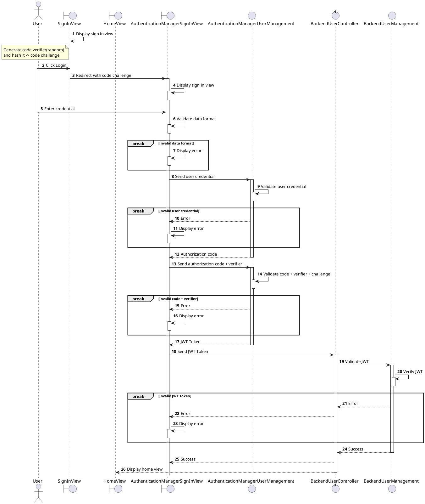
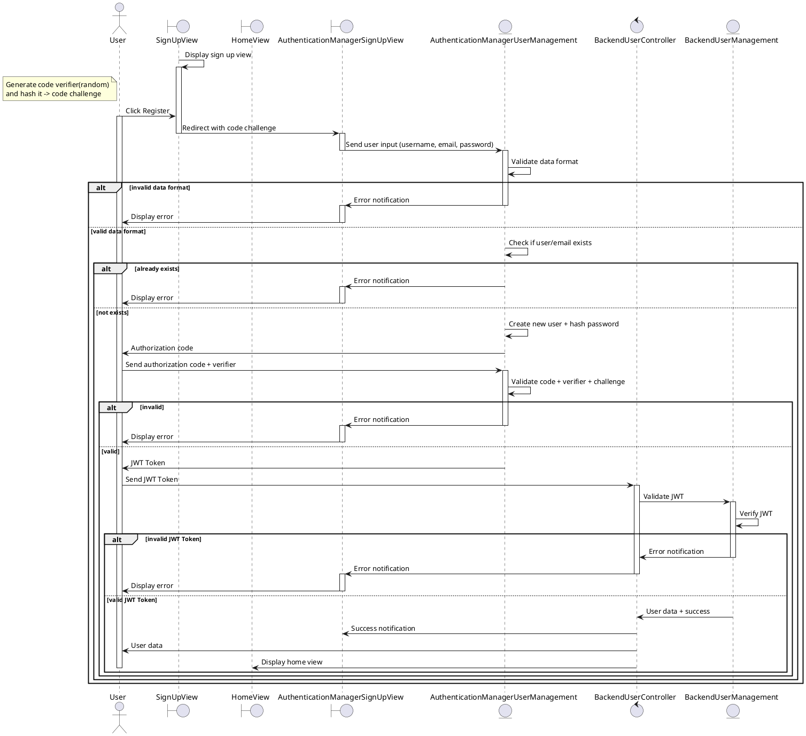

# Sign In with Credential

```plantuml
@startuml
autonumber

actor User as U
boundary SignInView as SIV
boundary HomeView as HV
boundary AuthenticationManagerSignInView as AMSIV
entity AuthenticationManagerUserManagement as AMUM
control BackendUserController as BUC
entity BackendUserManagement as BUM

SIV -> SIV: Display sign in view
note left of SIV: Generate code verifier(random)\nand hash it -> code challenge
U -> SIV: Click Login
activate U
SIV -> AMSIV: Redirect with code challenge
activate AMSIV

AMSIV -> AMSIV: Display sign in view
activate AMSIV
deactivate AMSIV
U -> AMSIV : Enter credential
deactivate U
AMSIV -> AMSIV: Validate data format
activate AMSIV
deactivate AMSIV

break invalid data format
  AMSIV -> AMSIV: Display error
  activate AMSIV
  deactivate AMSIV
end

AMSIV -> AMUM: Send user credential
activate AMUM

AMUM -> AMUM: Validate user credential
activate AMUM
deactivate AMUM

break invalid user credential
  AMSIV <-- AMUM: Error
  AMSIV -> AMSIV: Display error
  activate AMSIV
  deactivate AMSIV
end

AMSIV <-- AMUM: Authorization code
deactivate AMUM

AMSIV -> AMUM: Send authorization code + verifier
activate AMUM
AMUM -> AMUM: Validate code + verifier + challenge
activate AMUM
deactivate AMUM

break invalid code + verifier
  AMSIV <-- AMUM: Error
  AMSIV -> AMSIV: Display error
  activate AMSIV
  deactivate AMSIV
end

AMSIV <-- AMUM: JWT Token
deactivate AMUM

AMSIV -> BUC: Send JWT Token

activate BUC

BUC -> BUM: Validate JWT
activate BUM
BUM -> BUM: Verify JWT
activate BUM
deactivate BUM

break invalid JWT Token
  BUC <-- BUM: Error
  AMSIV <-- BUC: Error
  AMSIV -> AMSIV: Display error
  activate AMSIV
  deactivate AMSIV
end

BUC <-- BUM: Success
deactivate BUM
AMSIV <-- BUC: Success
HV <-- BUC: Display home view
deactivate BUC
deactivate HV
@enduml
```

<!-- diagram id="sequence-credential-login" -->

# Register

```plantuml
@startuml
actor User
boundary SignUpView
boundary HomeView
boundary AuthenticationManagerSignUpView as AMSignUpView
entity AuthenticationManagerUserManagement as AMUserManagement
control BackendUserController
entity BackendUserManagement

SignUpView -> SignUpView: Display sign up view
activate SignUpView
note left of User: Generate code verifier(random)\nand hash it -> code challenge
User -> SignUpView: Click Register
activate User
SignUpView -> AMSignUpView: Redirect with code challenge
deactivate SignUpView
activate AMSignUpView

AMSignUpView -> AMUserManagement: Send user input (username, email, password)
deactivate AMSignUpView
activate AMUserManagement

AMUserManagement -> AMUserManagement: Validate data format

alt invalid data format
  AMUserManagement -> AMSignUpView: Error notification
  deactivate AMUserManagement
  activate AMSignUpView
  AMSignUpView -> User: Display error
  deactivate AMSignUpView

else valid data format
  AMUserManagement -> AMUserManagement: Check if user/email exists

  alt already exists
    AMUserManagement -> AMSignUpView: Error notification
    deactivate AMUserManagement
    activate AMSignUpView
    AMSignUpView -> User: Display error
    deactivate AMSignUpView

  else not exists
    AMUserManagement -> AMUserManagement: Create new user + hash password
    AMUserManagement -> User: Authorization code
    deactivate AMUserManagement


    User -> AMUserManagement: Send authorization code + verifier

    activate AMUserManagement
    AMUserManagement -> AMUserManagement: Validate code + verifier + challenge

    alt invalid
      AMUserManagement -> AMSignUpView: Error notification
      deactivate AMUserManagement
      activate AMSignUpView
      AMSignUpView -> User: Display error
      deactivate AMSignUpView

    else valid
      AMUserManagement -> User: JWT Token
      deactivate AMUserManagement


      User -> BackendUserController: Send JWT Token

      activate BackendUserController

      BackendUserController -> BackendUserManagement: Validate JWT
      activate BackendUserManagement
      BackendUserManagement -> BackendUserManagement: Verify JWT

      alt invalid JWT Token
        BackendUserManagement -> BackendUserController: Error notification
        deactivate BackendUserManagement
        BackendUserController -> AMSignUpView: Error notification
        deactivate BackendUserController
        activate AMSignUpView
        AMSignUpView -> User: Display error
        deactivate AMSignUpView

      else valid JWT Token
        BackendUserManagement -> BackendUserController: User data + success
        deactivate BackendUserManagement
        BackendUserController -> AMSignUpView: Success notification
        BackendUserController -> User: User data
        BackendUserController -> HomeView: Display home view
        deactivate BackendUserController
        deactivate User
        deactivate HomeView
      end
    end
  end
end
@enduml
```

<!-- diagram id="sequence-credential-register" -->
