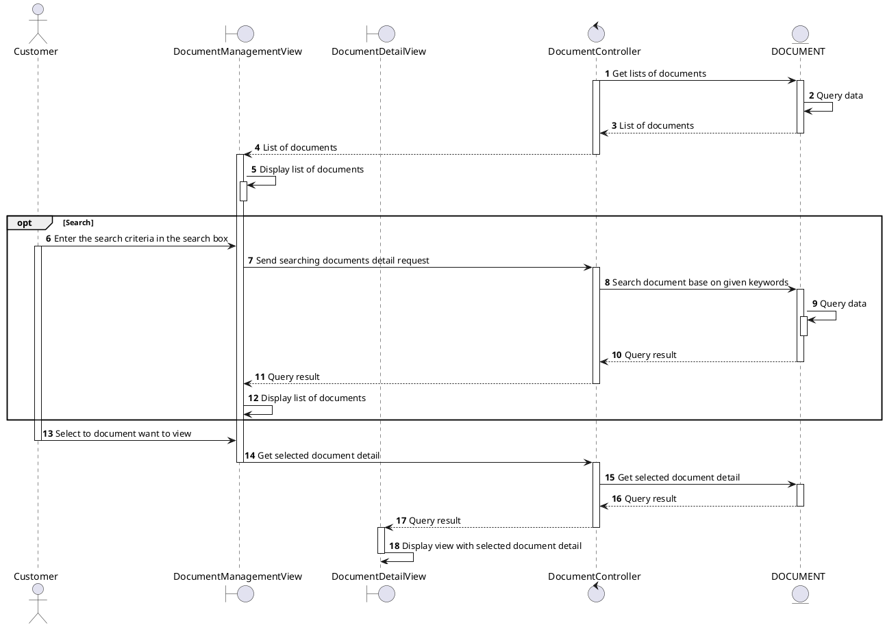

# Sequence View Document

```plantuml
@startuml
autonumber

actor Customer as C
boundary DocumentManagementView as DMV
boundary DocumentDetailView as DDV
control DocumentController as DC
entity DOCUMENT as D

DC -> D: Get lists of documents
activate DC
activate D
D -> D: Query data
DC <-- D: List of documents
deactivate D
DMV <-- DC: List of documents
deactivate DC
activate DMV
DMV -> DMV: Display list of documents
activate DMV
deactivate DMV
opt Search
  C -> DMV: Enter the search criteria in the search box
  activate C
  DMV -> DC: Send searching documents detail request
  activate DC
  DC -> D: Search document base on given keywords
  activate D
  D -> D: Query data
  activate D
  deactivate D
  DC <-- D: Query result
  deactivate D
  DMV <-- DC: Query result
  deactivate DC
  DMV -> DMV: Display list of documents
end
C -> DMV: Select to document want to view
deactivate C
DMV -> DC: Get selected document detail
deactivate DMV
activate DC
DC -> D: Get selected document detail
activate D
DC <-- D: Query result
deactivate D
DDV <-- DC: Query result
deactivate DC
activate DDV
DDV -> DDV: Display view with selected document detail
deactivate DDV

@enduml
```

<!-- diagram id="sequence-view-document-view-document" -->
