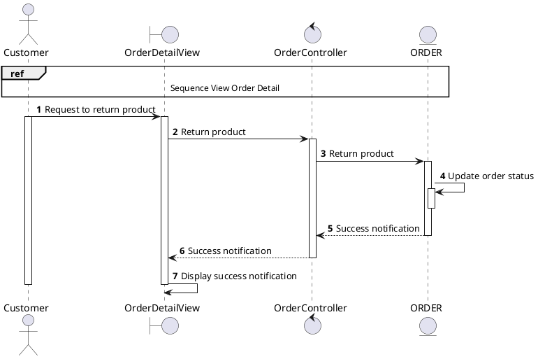

# Sequence Return Product

```plantuml
@startuml
autonumber

actor Customer as C
boundary OrderDetailView as ODV
control OrderController as OC
entity ORDER as O

ref over C, O: Sequence View Order Detail
C -> ODV: Request to return product
activate C
activate ODV
ODV -> OC: Return product
activate OC
OC -> O: Return product
activate O
O -> O: Update order status
activate O
deactivate O
OC <-- O: Success notification
deactivate O
ODV <-- OC: Success notification
deactivate OC
ODV -> ODV: Display success notification
deactivate ODV
deactivate C

@enduml
```

<!-- diagram id="sequence-view-order-return-product" -->
