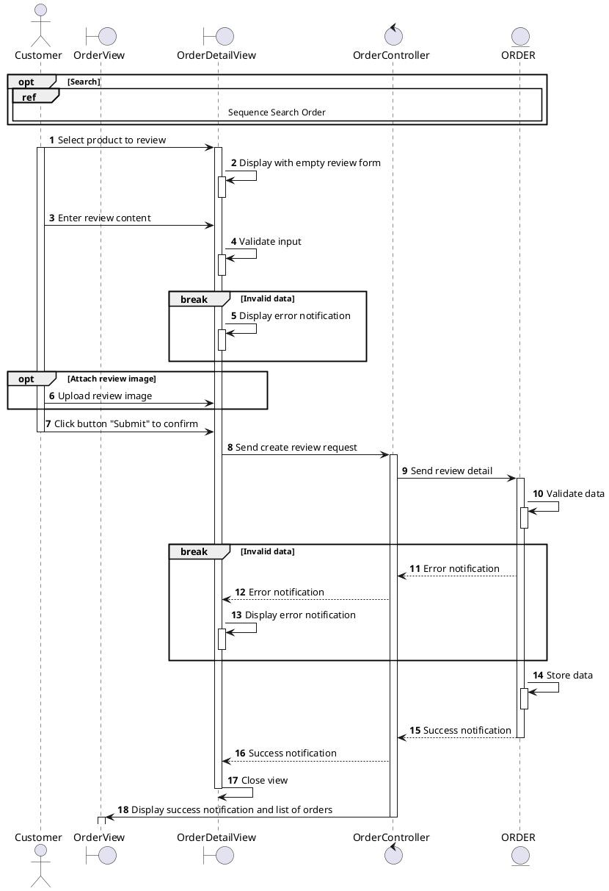

# Sequence Review Product

```plantuml
@startuml
autonumber

actor Customer as C
boundary OrderView as OV
boundary OrderDetailView as ODV
control OrderController as OC
entity ORDER as O

opt Search
  ref over C, O: Sequence Search Order
end
C -> ODV: Select product to review
activate C
activate ODV
ODV -> ODV: Display with empty review form
activate ODV
deactivate ODV
C -> ODV: Enter review content
ODV -> ODV: Validate input
activate ODV
deactivate ODV
break Invalid data
  ODV -> ODV: Display error notification
  activate ODV
  deactivate ODV
end
opt Attach review image
  C -> ODV: Upload review image
end
C -> ODV: Click button "Submit" to confirm
deactivate C
ODV -> OC: Send create review request
activate OC
OC -> O: Send review detail
activate O
O -> O: Validate data
activate O
deactivate O
break Invalid data
  OC <-- O: Error notification
  ODV <-- OC: Error notification
  ODV -> ODV: Display error notification
  activate ODV
  deactivate ODV
end
O -> O: Store data
activate O
deactivate O
OC <-- O: Success notification
deactivate O
ODV <-- OC: Success notification
ODV -> ODV: Close view
deactivate ODV
OV <- OC: Display success notification and list of orders
deactivate OC
activate OV

@enduml
```

<!-- diagram id="sequence-view-order-review-product" -->
