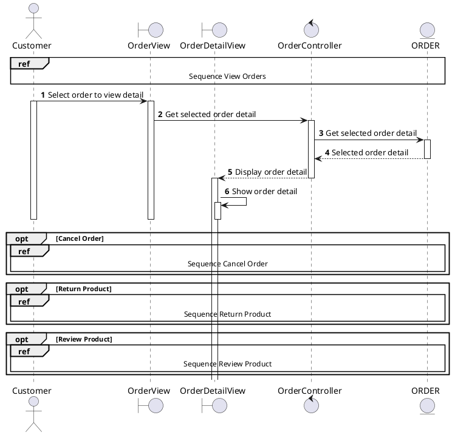

# Sequence View Order Detail

```plantuml
@startuml
autonumber

actor Customer as C
boundary OrderView as OV
boundary OrderDetailView as ODV
control OrderController as OC
entity ORDER as O

ref over C, O: Sequence View Orders
C -> OV: Select order to view detail
activate C
activate OV
OV -> OC: Get selected order detail
activate OC
OC -> O: Get selected order detail
activate O
OC <-- O: Selected order detail
deactivate O
ODV <-- OC: Display order detail
deactivate OC
activate ODV
ODV -> ODV: Show order detail
activate ODV
deactivate ODV
deactivate OV
deactivate C

opt Cancel Order
  ref over C, O: Sequence Cancel Order
end

opt Return Product
  ref over C, O: Sequence Return Product
end

opt Review Product
  ref over C, O: Sequence Review Product
end

@enduml
```

<!-- diagram id="sequence-view-order-view-order-detail" -->
